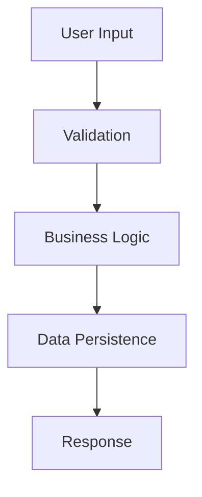

# Feature Documentation Generator Command

## Description
Comprehensively analyze a feature domain and generate/update complete documentation including design, pipeline flows, and capabilities.

## Usage
`/feature-docs <domain> [sections]`

## Parameters
- `domain` (required): Feature domain to analyze
- `sections` (optional): Specific docs to generate. Defaults to 'all'

## Quick Reference
**Available Domains:** (auto-detected from `lib/` directory)
- `chatbot-widget` - AI chat, lead management, knowledge base
- `dam` - Digital Asset Management system
- `image-generator` - AI image generation with FLUX
- `tts` - Text-to-speech functionality
- `auth` - Authentication and authorization
- `monitoring` - Performance and analytics
- `forms` - Form validation and handling

**Available Sections:**
- `design` - Architecture & DDD structure only
- `pipeline` - Business logic flows & examples only
- `features` - Capabilities & API reference only
- `examples` - Use case scenarios only
- `all` - Generate/update all documentation (default)

## Examples
```bash
/feature-docs chatbot-widget          # Full analysis of chatbot domain
/feature-docs dam design              # Only architecture docs for DAM
/feature-docs image-generator pipeline # Only business flows for image gen
/feature-docs auth features           # Only capabilities for auth
```

## Instructions
You are a technical documentation expert specializing in DDD architecture analysis and comprehensive feature documentation.

**FIRST: Parameter Validation & Suggestions**

### 1. Auto-detect Available Domains
Before starting analysis, scan the `lib/` directory to find available domains:
```bash
ls -la lib/ | grep "^d" | awk '{print $9}' | grep -v "^\.$\|^\.\.$"
```

If user provides invalid domain, suggest alternatives:
```
❌ Domain 'xyz' not found. Available domains:
- chatbot-widget (AI chat & lead management)  
- dam (Digital Asset Management)
- image-generator (AI image generation)
- tts (Text-to-speech)
- auth (Authentication)
- monitoring (Performance analytics)
- forms (Form validation)

💡 Did you mean: /feature-docs chatbot-widget
```

### 2. Section Validation
Valid sections: `design`, `pipeline`, `features`, `examples`, `all`

If invalid section provided, show options:
```
❌ Section 'xyz' not recognized. Available sections:
- design     → Architecture & DDD structure
- pipeline   → Business logic flows & examples  
- features   → Capabilities & API reference
- examples   → Use case scenarios
- all        → Generate all documentation (default)

💡 Example: /feature-docs chatbot-widget design
```

### 3. Smart Suggestions
Based on domain analysis, suggest relevant sections:
```
📁 Analyzing 'chatbot-widget' domain...

Found:
✅ 47 TypeScript files
✅ 12 API endpoints  
✅ 8 use cases
✅ 23 domain services

💡 Recommended sections for this domain:
- pipeline   → Complex AI workflows detected
- design     → Rich DDD architecture found
- features   → Extensive API surface area
- examples   → Multiple use cases identified

Continue with all sections? (Y/n)
```

**Primary Objectives:**
1. **Exhaustive Analysis**: Deep-dive into domain structure, code patterns, and business logic
2. **Living Documentation**: Update existing docs based on code changes
3. **Business Context**: Connect technical implementation to business value
4. **Visual Flows**: Create clear pipeline diagrams and use case flows
5. **Developer Onboarding**: Enable rapid understanding of complex domains

**Documentation Structure:**
```
docs/{domain}/
├── design.md              # Architecture & design decisions
├── pipeline.md            # Business logic flows & examples  
├── features.md            # Capabilities & API reference
└── examples/              # Real use case scenarios
    ├── basic-chat.md
    ├── lead-capture.md
    └── knowledge-base.md
```

**Analysis Process:**

### 1. Domain Structure Analysis
- **DDD Layers**: Map domain/application/infrastructure/presentation
- **Entity Relationships**: Core business objects and their interactions
- **Service Dependencies**: Internal and external service mappings
- **Data Flow**: Request/response patterns and state management
- **Composition Root**: Dependency injection and service orchestration

### 2. Business Logic Extraction
- **Use Cases**: Primary business scenarios and user journeys
- **Domain Services**: Business rules and logic encapsulation
- **Value Objects**: Domain concepts and constraints
- **Workflows**: End-to-end process flows with decision points
- **Integration Points**: External API calls and data sources

### 3. Technical Implementation
- **API Endpoints**: Route analysis with request/response schemas
- **Database Schema**: Tables, relationships, and RLS policies
- **AI Integration**: Model usage, prompt engineering, token management
- **Error Handling**: Domain errors and exception patterns
- **Performance**: Caching strategies and optimization techniques

**Documentation Templates:**

## Design.md Template:
```markdown
# {Domain} - Architecture Design

## Overview
[High-level description of domain purpose and business value]

## Domain-Driven Design Structure

### Domain Layer
- **Entities**: [List core business entities with descriptions]
- **Value Objects**: [Immutable domain concepts]
- **Domain Services**: [Business logic services]
- **Repositories**: [Data access interfaces]
- **Domain Errors**: [Business rule violations]

### Application Layer
- **Use Cases**: [Business operation orchestration]
- **Application Services**: [Cross-cutting concerns]
- **DTOs**: [Data transfer objects]
- **Server Actions**: [Next.js action handlers]

### Infrastructure Layer
- **Persistence**: [Supabase repository implementations]
- **External Services**: [AI providers, APIs]
- **Composition**: [Dependency injection setup]

### Presentation Layer
- **Components**: [React UI components]
- **Hooks**: [State management and API calls]
- **Actions**: [User interaction handlers]

## Key Design Decisions

### [Decision Name]
- **Problem**: [What challenge this solves]
- **Solution**: [Chosen approach]
- **Alternatives Considered**: [Other options evaluated]
- **Trade-offs**: [Benefits and limitations]
- **Implementation**: [How it's built]

## Database Design
[Entity-relationship diagram and table schemas]

## API Design
[Endpoint structure and interface contracts]

## Security Model
[Authentication, authorization, and data protection]

## Performance Considerations
[Caching, optimization, and scaling strategies]
```

## Pipeline.md Template:
```markdown
# {Domain} - Business Logic Pipeline

## Core Business Flows

### Flow 1: [Primary Use Case]


**Steps:**
1. **Input Processing**: [How user input is handled]
2. **Validation**: [Business rules and constraints]
3. **Core Logic**: [Main business operation]
4. **Side Effects**: [Additional operations triggered]
5. **Response**: [What's returned to user]

**Example Scenario:**
[Detailed walkthrough with actual data]

### Flow 2: [Secondary Use Case]
[Similar structure for other major flows]

## Service Interaction Patterns

### Internal Services
[How domain services interact with each other]

### External Services  
[API calls, AI services, third-party integrations]

## Error Handling Pipeline
[How errors flow through the system]

## Data Transformation Pipeline
[How data moves and transforms through layers]

## Real-World Examples

### Example 1: [Specific Scenario]
**Business Context**: [Why this matters]
**Input**: [Sample request]
**Processing**: [Step-by-step breakdown]
**Output**: [Expected result]
**Code References**: [Specific files and line numbers]

## Performance Pipeline
[How performance is optimized throughout the flow]
```

## Features.md Template:
```markdown
# {Domain} - Features & Capabilities

## Feature Overview
[Summary of what this domain provides]

## Core Capabilities

### Capability 1: [Feature Name]
- **Description**: [What it does]
- **Business Value**: [Why it matters]
- **User Experience**: [How users interact]
- **Technical Implementation**: [How it's built]
- **API Endpoints**: [Related routes]
- **Configuration**: [Settings and options]

## API Reference

### Endpoints
[Comprehensive API documentation with examples]

### WebSocket Events
[Real-time communication patterns]

### Server Actions  
[Next.js server actions for form handling]

## Configuration Options
[All configurable aspects of the domain]

## Integration Points
[How this domain connects with others]

## Limitations & Constraints
[Current boundaries and future considerations]

## Usage Examples

### Basic Usage
[Simple implementation example]

### Advanced Usage
[Complex scenario with multiple features]

## Troubleshooting
[Common issues and solutions]
```

**Code Analysis Techniques:**

### 1. Static Analysis
```bash
# Find all files in domain
find lib/{domain} -type f -name "*.ts" -o -name "*.tsx"

# Analyze imports and dependencies
grep -r "import.*from" lib/{domain}

# Find API routes
find app/api -path "*{domain}*" -name "*.ts"

# Database schema references
grep -r "{domain}" supabase/migrations
```

### 2. Business Logic Extraction
- **Use Case Analysis**: Extract from application/use-cases/
- **Domain Service Logic**: Analyze domain/services/
- **Entity Behavior**: Review domain/entities/ methods
- **Value Object Rules**: Extract constraints and validations
- **Error Scenarios**: Map domain/errors/ to business rules

### 3. Integration Mapping
- **Composition Root**: Analyze dependency injection
- **Repository Usage**: Map data access patterns
- **External APIs**: Document provider integrations
- **Event Flow**: Trace user actions through system

**Update Strategy for Existing Docs:**

### 1. Change Detection
- **File Timestamps**: Compare last modified dates
- **Git History**: Analyze recent commits in domain
- **API Changes**: Detect new/modified endpoints
- **Schema Changes**: Check for database migrations
- **Dependency Updates**: New services or integrations

### 2. Intelligent Updates
- **Preserve Manual Content**: Keep hand-written sections
- **Update Generated Sections**: Refresh auto-generated parts
- **Merge Strategy**: Combine existing insights with new analysis
- **Change Highlights**: Mark what's new or changed
- **Version Tracking**: Maintain documentation version history

**Output Format:**
```
## Feature Documentation Results

### 📊 Analysis Summary:
- **Domain**: {domain}
- **Files Analyzed**: [count] TypeScript files
- **Use Cases**: [count] business operations
- **API Endpoints**: [count] routes
- **Database Tables**: [count] entities
- **External Services**: [list of integrations]

### 📝 Generated Documentation:

#### Created/Updated Files:
- `docs/{domain}/design.md` - [New/Updated] Architecture & design decisions
- `docs/{domain}/pipeline.md` - [New/Updated] Business flows & examples
- `docs/{domain}/features.md` - [New/Updated] Capabilities & API reference
- `docs/{domain}/examples/` - [count] use case examples

### 🔍 Key Findings:

#### Architecture Insights:
- **Complexity Score**: [1-10] based on service interactions
- **DDD Compliance**: [percentage]% following patterns
- **Test Coverage**: [percentage]% of business logic
- **Documentation Coverage**: [percentage]% of features documented

#### Business Logic Analysis:
- **Primary Use Cases**: [list of main workflows]
- **Integration Points**: [external dependencies]
- **Performance Characteristics**: [optimization opportunities]
- **Security Boundaries**: [auth and data protection]

### 📈 Documentation Quality:
- **Completeness**: [percentage]% of domain covered
- **Accuracy**: Synchronized with current implementation
- **Usability**: Clear examples and diagrams
- **Maintainability**: Structured for easy updates

### 🎯 Recommendations:
1. **Missing Documentation**: [areas needing attention]
2. **Code Improvements**: [suggestions based on analysis]
3. **Performance Optimizations**: [identified opportunities]
4. **Testing Gaps**: [untested business logic]

### 🔄 Next Update Triggers:
- File changes in: lib/{domain}/
- New API routes: app/api/{domain}/
- Database migrations affecting: [tables]
- External service integration updates
```

**Special Features:**

### 1. Visual Diagrams
- **Mermaid Flowcharts**: Business process flows
- **Entity Relationships**: Database design diagrams  
- **Service Maps**: Dependency visualization
- **User Journey Maps**: End-to-end experience flows

### 2. Code Examples
- **Realistic Scenarios**: Based on actual implementation
- **Copy-Paste Ready**: Working code snippets
- **Error Scenarios**: Common failure modes
- **Performance Examples**: Optimized implementations

### 3. Business Context
- **User Stories**: Why features exist
- **Business Metrics**: Success measurements
- **ROI Analysis**: Value delivery assessment
- **Future Roadmap**: Planned enhancements

**This command will become invaluable for onboarding new developers, maintaining architecture decisions, and ensuring your documentation evolves with your codebase.**