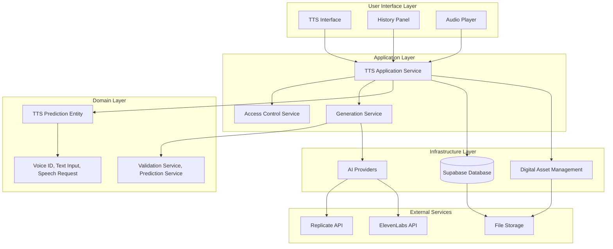
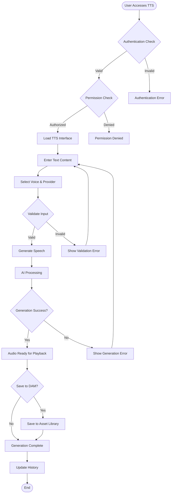
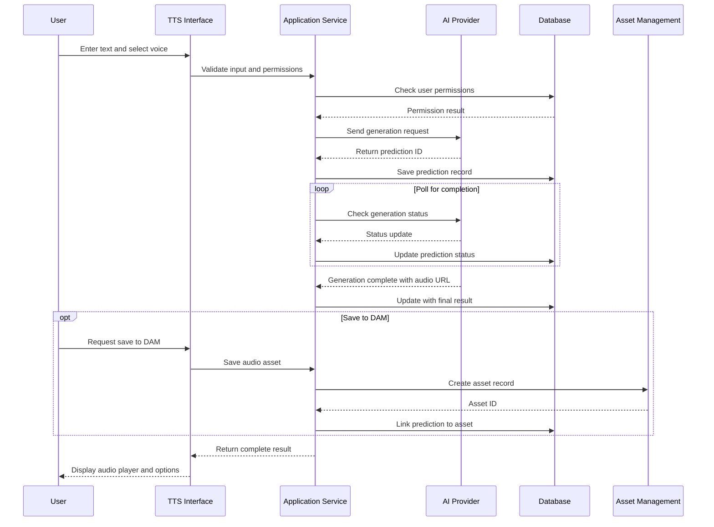
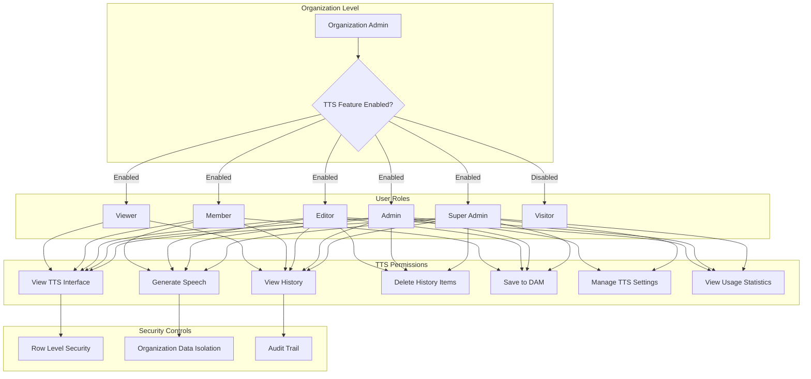

# Text-to-Speech (TTS) Feature Documentation

## 1. Executive Summary

The Text-to-Speech (TTS) feature is a sophisticated AI-powered service that converts written text into natural-sounding spoken audio. Built with enterprise-grade architecture, it supports multiple AI providers, maintains comprehensive usage history, and integrates seamlessly with the organization's Digital Asset Management (DAM) system.

**Key Business Value:**
- Transform written content into professional audio for presentations, training materials, and accessibility compliance
- Support multiple voice options and languages for diverse organizational needs
- Reduce content production costs by eliminating the need for human voice recording
- Ensure consistent audio quality across all organizational content
- Enable rapid content scaling for global teams

**Strategic Benefits:**
- **Cost Efficiency**: Eliminate recurring voice actor fees
- **Speed to Market**: Generate audio content in minutes instead of days
- **Brand Consistency**: Maintain uniform voice quality across all materials
- **Accessibility Compliance**: Support ADA and accessibility requirements
- **Global Reach**: Support multiple languages and accents

## 2. Feature Overview

### What It Does
The TTS feature converts any text input into high-quality spoken audio using advanced AI voice synthesis technology. Users can select from a variety of professional voices, customize speech parameters, and generate audio files that can be immediately used or saved to the organization's asset library.

### Business Value
- **Content Production**: Create voiceovers for training videos, presentations, and marketing materials
- **Accessibility**: Provide audio versions of written content for visually impaired users
- **Multilingual Support**: Generate content in multiple languages and accents
- **Cost Reduction**: Eliminate dependency on external voice recording services
- **Quality Assurance**: Ensure consistent audio quality across all organizational content

### Target Users
- **Content Creators**: Marketing teams, training specialists, and content managers
- **Accessibility Coordinators**: Teams ensuring compliance with accessibility standards
- **International Teams**: Organizations requiring multilingual content
- **Product Managers**: Teams creating user-facing audio content
- **Training Departments**: HR and learning & development teams

## 3. Core Capabilities

### Voice Selection and Customization
- **Multiple Voice Options**: Choose from male and female voices across different accents
- **Provider Diversity**: Access voices from multiple AI providers (Replicate Kokoro, ElevenLabs)
- **Voice Characteristics**: Select based on gender, accent (American, British), and tone
- **Quality Consistency**: All voices maintain professional broadcast quality

### Text Processing and Validation
- **Smart Text Processing**: Automatic text validation and optimization for speech generation
- **Character Limits**: Support for both short phrases and long-form content
- **Format Support**: Process plain text with intelligent punctuation handling
- **Quality Assurance**: Built-in validation to ensure optimal speech generation

### Audio Generation and Management
- **High-Quality Output**: Generate professional-grade audio files
- **Multiple Formats**: Support for various audio formats suitable for different use cases
- **Immediate Playback**: Preview generated audio instantly within the interface
- **Download Options**: Save audio files for external use or integration

### History and Asset Management
- **Complete Generation History**: Track all text-to-speech generations with timestamps
- **Replay Functionality**: Easily regenerate audio from previous text inputs
- **Asset Integration**: Save generated audio directly to the organization's Digital Asset Management system
- **Search and Filter**: Quickly locate previous generations using text search

### Organization and Security Features
- **Multi-Tenant Support**: Complete isolation between different organizations
- **Role-Based Access**: Granular permissions based on user roles within the organization
- **Usage Tracking**: Monitor feature usage and generation patterns
- **Error Recovery**: Robust error handling and retry mechanisms

## 4. User Workflows

### Basic Text-to-Speech Generation

**Step 1: Access the TTS Interface**
- Navigate to AI Playground → Text-to-Speech
- The system automatically loads with your organization context
- Verify that TTS features are enabled for your organization

**Step 2: Enter Your Text**
- Type or paste your text into the input field
- The system validates text length and content automatically
- Preview shows character count and estimated generation time

**Step 3: Select Voice and Provider**
- Choose from available voice options organized by:
  - Gender (Male/Female)
  - Accent (American, British, Other)
  - Provider (Replicate, ElevenLabs)
- Preview voice characteristics before generation

**Step 4: Generate Audio**
- Click "Generate Speech" to start the AI processing
- Monitor real-time progress through status updates
- System automatically handles provider selection and optimization

**Step 5: Review and Use Audio**
- Play generated audio using built-in player controls
- Download audio file for external use
- Save to organization's Digital Asset Management system
- Share with team members or integrate into projects

### Advanced Workflow: Content Library Integration

**Step 1: Load Text from Existing Assets**
- Click "Load from Library" to access organizational text assets
- Browse and select from previously saved documents
- System automatically populates text field with selected content
- Maintains link to source material for tracking

**Step 2: Generate and Save Audio Assets**
- Generate speech using selected voice and settings
- Use "Save As" dialog to specify meaningful asset names
- Choose appropriate categorization and metadata
- System creates automatic linking between text and audio assets

**Step 3: Asset Management and Organization**
- View all generated audio in centralized DAM system
- Organize assets using folders and tags
- Set permissions for team access and collaboration
- Track usage and download statistics

### History Management and Reuse

**Step 1: Access Generation History**
- Click the History button (clock icon) to view all previous generations
- History panel shows chronological list of all text-to-speech requests
- Each entry displays text preview, voice used, and generation status

**Step 2: Reuse Previous Generations**
- Search history using text content or filter by date
- Click "Reload" to populate form with previous inputs
- Click "Play" to listen to previously generated audio
- Use "Save to DAM" for any audio not yet saved to asset library

**Step 3: Manage Historical Data**
- Review generation patterns and frequently used content
- Identify opportunities for content reuse and standardization
- Clean up expired or outdated generations
- Export usage reports for analysis and planning

### Collaborative Content Creation

**Step 1: Team Workflow Setup**
- Coordinate with team members on voice selection standards
- Establish naming conventions for generated assets
- Set up shared folders in DAM for collaborative access
- Define quality standards and review processes

**Step 2: Content Production Pipeline**
- Content creators input text and generate initial audio
- Reviewers access assets through DAM system for approval
- Approved audio assets are tagged and organized for production use
- Version control maintains history of revisions and updates

**Step 3: Distribution and Usage**
- Export approved audio for integration into presentations, videos, or applications
- Share DAM links with external teams or contractors
- Track usage and performance of generated content
- Gather feedback for continuous improvement

## 5. Use Cases

### Marketing and Communications

**Product Demonstrations**
- Generate professional voiceovers for product demo videos
- Create consistent narration across multiple product showcases
- Support multilingual product launches with localized audio
- Reduce production time from weeks to hours

**Training and Onboarding**
- Produce audio for employee training modules
- Create accessibility-compliant training materials
- Generate voiceovers for safety and compliance videos
- Scale training content across multiple locations

**Customer Communication**
- Create professional phone system messages and hold music narration
- Generate audio for customer support tutorials
- Produce promotional announcements and newsletters in audio format
- Support customers with varying accessibility needs

### Content and Media Production

**Educational Content**
- Transform written course materials into audio learning resources
- Create audiobook versions of training manuals and documentation
- Generate podcast-style content from blog posts and articles
- Support different learning styles with multi-modal content delivery

**Social Media and Digital Marketing**
- Create audio content for social media posts and stories
- Generate voiceovers for short-form video content
- Produce audio advertisements and promotional materials
- Scale content production for multiple platforms and audiences

**Internal Communications**
- Convert important announcements into audio format for accessibility
- Create audio versions of company newsletters and updates
- Generate voiceovers for internal training and safety videos
- Support remote and distributed team communication

### Accessibility and Compliance

**ADA Compliance**
- Provide audio alternatives for all written content
- Ensure equal access to information for visually impaired users
- Meet legal requirements for accessibility in public-facing content
- Support organizational diversity and inclusion initiatives

**Multilingual Support**
- Generate content in multiple languages for global teams
- Create localized audio for international markets
- Support diverse workforce communication needs
- Enable consistent messaging across different regions

### Technical and Documentation

**API Documentation and Tutorials**
- Create audio guides for technical documentation
- Generate voiceovers for software tutorial videos
- Produce audio help content for applications and platforms
- Support user onboarding with multi-modal guidance

**Process Documentation**
- Transform written procedures into audio instructions
- Create audio guides for complex operational procedures
- Generate safety briefings and compliance instructions
- Support hands-free workflow guidance

## 6. Technical Overview

### Architecture Foundation
The TTS feature is built using Domain-Driven Design (DDD) principles, ensuring clean separation of concerns and maintainable code architecture. The system consists of four main layers:

**Domain Layer**: Contains core business logic, entities, and rules specific to text-to-speech operations
**Application Layer**: Orchestrates use cases and coordinates between different system components
**Infrastructure Layer**: Manages external integrations with AI providers and data storage
**Presentation Layer**: Handles user interfaces and interaction patterns

### AI Provider Integration
The system supports multiple AI providers through a unified interface:

**Replicate Integration**: Utilizes Kokoro-82M model for high-quality speech synthesis
**ElevenLabs Integration**: Provides premium voice options with advanced customization
**Provider Abstraction**: Seamless switching between providers based on requirements
**Fallback Mechanisms**: Automatic failover ensures service reliability

### Data Management
**Secure Storage**: All generated audio and metadata stored with enterprise-grade security
**Organization Isolation**: Complete data separation between different organizations
**Asset Integration**: Seamless connection with Digital Asset Management system
**Performance Optimization**: Intelligent caching and content delivery optimization

### Security and Compliance
**Role-Based Access Control**: Granular permissions based on organizational roles
**Data Encryption**: End-to-end encryption for all text inputs and generated audio
**Audit Trails**: Comprehensive logging of all generation activities
**Privacy Controls**: User data protection and retention policy compliance

## 7. Integration Points

### Digital Asset Management (DAM) System
The TTS feature seamlessly integrates with the organization's DAM system to provide unified content management:

**Bi-Directional Integration**
- **Input**: Load text content from existing DAM assets for speech generation
- **Output**: Save generated audio directly to DAM with proper metadata and categorization
- **Linking**: Automatic association between source text assets and generated audio files
- **Version Control**: Track relationships between different versions of content

**Asset Organization**
- **Automatic Categorization**: Generated audio files are automatically tagged and categorized
- **Metadata Management**: Rich metadata including voice characteristics, generation date, and source information
- **Search Integration**: TTS-generated content becomes searchable within the broader DAM system
- **Permission Inheritance**: DAM permissions apply to TTS-generated content

### Authentication and Authorization System
**Organization Context Management**
- **Multi-Tenant Architecture**: Complete isolation between different organizations
- **Role-Based Permissions**: Integration with organizational role and permission system
- **Feature Flags**: Administrative control over TTS feature availability per organization
- **Session Management**: Secure session handling with automatic organization context

**Permission Levels**
- **Viewer**: Can view TTS interface and history but cannot generate new content
- **Member**: Basic TTS generation capabilities and personal history access
- **Editor**: Full TTS features including DAM integration and team history access
- **Admin**: Complete TTS management including settings and usage analytics

### AI Provider Ecosystem
**Multi-Provider Architecture**
- **Provider Abstraction**: Unified interface regardless of underlying AI provider
- **Load Balancing**: Intelligent distribution of requests across available providers
- **Quality Optimization**: Automatic provider selection based on content characteristics
- **Cost Management**: Provider selection based on organizational preferences and usage patterns

**Service Reliability**
- **Redundancy**: Multiple provider options ensure service availability
- **Health Monitoring**: Continuous monitoring of provider status and performance
- **Automatic Failover**: Seamless switching to backup providers during outages
- **Performance Tracking**: Real-time monitoring of generation speed and quality

### Content Management Workflow
**Editorial Integration**
- **Content Pipeline**: Integration with existing content creation and approval workflows
- **Review Process**: TTS generations can be incorporated into standard review cycles
- **Publication Workflow**: Generated audio follows same approval path as other content types
- **Quality Assurance**: Integration with organizational quality control processes

**Version Management**
- **Content Versioning**: Generated audio versions tracked alongside source content versions
- **Change Tracking**: Audit trail of modifications and regenerations
- **Rollback Capability**: Ability to revert to previous versions of generated content
- **Approval Workflow**: Integration with content approval and publication processes

## 8. Visual Diagrams

### System Architecture Overview

### User Workflow Process

### Data Flow and Integration

### Permission and Security Model

## 9. Troubleshooting

### Common Issues and Solutions

#### Audio Generation Failures

**Issue**: "Speech generation failed" error message
**Symptoms**: Generation starts but fails with error after processing
**Solutions**:
1. **Check Text Length**: Ensure text is within supported character limits (typically 1000-5000 characters)
2. **Verify Voice Selection**: Confirm selected voice is available for chosen provider
3. **Review Text Content**: Remove special characters or formatting that may cause issues
4. **Try Alternative Provider**: Switch between Replicate and ElevenLabs providers
5. **Contact Support**: If issue persists, contact technical support with error details

**Prevention**:
- Use text validation before submission
- Test with shorter content first
- Keep backup of original text content

#### Permission and Access Issues

**Issue**: "Insufficient permissions" or "Feature not available" messages
**Symptoms**: Cannot access TTS interface or specific features are disabled
**Solutions**:
1. **Verify Organization Access**: Confirm your organization has TTS feature enabled
2. **Check User Role**: Ensure your role includes necessary TTS permissions
3. **Contact Administrator**: Request role upgrade from organization administrator
4. **Clear Browser Cache**: Clear browser cache and cookies, then log in again
5. **Session Refresh**: Log out and log back in to refresh permissions

**Prevention**:
- Regularly review user permissions with administrators
- Understand role-based access limitations
- Maintain current browser and clear cache regularly

#### Audio Playback Problems

**Issue**: Generated audio won't play or has poor quality
**Symptoms**: Player shows error, audio is distorted, or no sound output
**Solutions**:
1. **Check Browser Settings**: Ensure browser allows audio playback and media permissions
2. **Test Different Browser**: Try accessing TTS in different web browser
3. **Update Audio Drivers**: Ensure computer audio drivers are current
4. **Check Network Connection**: Verify stable internet connection for audio streaming
5. **Download and Test**: Download audio file and test in external media player

**Prevention**:
- Use supported browsers (Chrome, Firefox, Safari, Edge)
- Keep browser and system updated
- Test audio setup with other applications

#### History and Asset Management Issues

**Issue**: Generated audio not appearing in history or DAM system
**Symptoms**: Recent generations missing from history panel or asset library
**Solutions**:
1. **Refresh Interface**: Use browser refresh or click refresh button in history panel
2. **Check Filters**: Verify no search filters are hiding relevant content
3. **Verify Save Action**: Confirm "Save to DAM" action was completed successfully
4. **Check Permissions**: Ensure you have permission to view history and assets
5. **Wait for Sync**: Allow time for system synchronization (typically 1-2 minutes)

**Prevention**:
- Explicitly save important generations to DAM
- Use descriptive names for saved assets
- Regularly backup important content

### Performance Optimization

#### Slow Generation Times

**Issue**: Speech generation takes longer than expected
**Expected Time**: Most generations complete within 30-90 seconds
**Optimization Steps**:
1. **Reduce Text Length**: Break long content into smaller segments
2. **Choose Optimal Provider**: Test different providers for speed comparison
3. **Off-Peak Usage**: Use during lower traffic periods when possible
4. **Network Optimization**: Ensure stable, high-speed internet connection

#### Interface Loading Issues

**Issue**: TTS interface loads slowly or incompletely
**Optimization Steps**:
1. **Clear Browser Cache**: Remove cached data and refresh page
2. **Disable Extensions**: Temporarily disable browser extensions that might interfere
3. **Check Network**: Verify stable internet connection
4. **Update Browser**: Ensure using latest browser version

### Error Code Reference

#### Generation Errors
- **TTS_001**: Invalid text input - check character limits and special characters
- **TTS_002**: Voice selection error - try different voice or provider
- **TTS_003**: Provider timeout - retry with same or different provider
- **TTS_004**: Processing queue full - retry after a few minutes

#### Permission Errors
- **AUTH_001**: User not authenticated - log in again
- **AUTH_002**: Insufficient permissions - contact administrator
- **AUTH_003**: Feature disabled - organization administrator needs to enable TTS
- **AUTH_004**: Session expired - refresh page and log in again

#### System Errors
- **SYS_001**: Database connection error - contact technical support
- **SYS_002**: File storage error - retry save operation
- **SYS_003**: External service unavailable - try alternative provider
- **SYS_004**: Network timeout - check internet connection and retry

### Getting Additional Help

#### Internal Support Resources
1. **Organization Administrator**: Contact for permission and access issues
2. **IT Support**: Contact for technical and browser-related problems
3. **Training Resources**: Access user guides and video tutorials
4. **User Community**: Connect with other users for tips and best practices

#### External Support
1. **Technical Support**: Submit support ticket for system-level issues
2. **Documentation**: Access comprehensive user documentation
3. **Video Tutorials**: Watch step-by-step guidance videos
4. **FAQ Database**: Search frequently asked questions

#### Escalation Process
1. **First Level**: Try troubleshooting steps and user documentation
2. **Second Level**: Contact organization administrator or IT support
3. **Third Level**: Submit technical support ticket with detailed error information
4. **Emergency**: Contact emergency support for business-critical issues

## 10. FAQ

### General Questions

**Q: What is the Text-to-Speech feature and how does it work?**
A: The TTS feature converts written text into natural-sounding spoken audio using advanced AI technology. You simply enter your text, select a voice, and the system generates professional-quality audio that you can play, download, or save to your organization's asset library.

**Q: Who can use the TTS feature?**
A: Access depends on your organization's settings and your user role. Most organizations enable TTS for all users, but specific capabilities (like generating speech, saving to assets, or viewing history) depend on your assigned role (Viewer, Member, Editor, or Admin).

**Q: Is there a cost for using TTS?**
A: TTS usage costs are managed at the organization level. Individual users typically don't see per-use charges, but organizations may have usage limits or cost controls in place. Contact your administrator for specific details about your organization's TTS policy.

**Q: What languages and voices are supported?**
A: The system supports multiple languages and accents including American English, British English, and various international options. Available voices include both male and female options across different providers. The specific selection may vary based on your organization's provider configuration.

### Technical Questions

**Q: What text formats are supported?**
A: The system accepts plain text input with standard punctuation. It automatically optimizes text for speech generation, handling paragraph breaks, punctuation, and common formatting. Very long texts may need to be divided into smaller segments for optimal results.

**Q: How long does it take to generate audio?**
A: Generation time varies based on text length and provider, but most requests complete within 30-90 seconds. Shorter texts (under 500 characters) typically generate in 15-30 seconds, while longer content may take up to 2-3 minutes.

**Q: What audio formats are provided?**
A: Generated audio is provided in high-quality formats suitable for most applications. The specific format depends on the AI provider but typically includes MP3 or WAV files that work with standard audio players and applications.

**Q: Can I edit or modify generated audio?**
A: The TTS system generates final audio files that cannot be directly edited within the platform. However, you can regenerate audio with modified text or different voice selections. For advanced audio editing, you can download files and use external audio editing software.

### Usage and Workflow Questions

**Q: How do I save generated audio for later use?**
A: You can save generated audio to your organization's Digital Asset Management (DAM) system by clicking "Save to Library" after generation. This makes the audio searchable and accessible to other team members based on your organization's sharing permissions.

**Q: Can I reuse previous generations?**
A: Yes, the History panel (clock icon) shows all your previous generations. You can replay audio, reload the text into the input form for modification, or save previously generated audio that wasn't initially saved to the DAM system.

**Q: How do I share generated audio with team members?**
A: Audio saved to the DAM system can be shared with team members according to your organization's permission settings. You can also download audio files and share them through other communication channels or include them in presentations and documents.

**Q: Can I generate audio from existing documents?**
A: Yes, you can load text from existing assets in your DAM system by clicking "Load from Library." This allows you to convert previously saved documents, scripts, or other text content into audio format.

### Quality and Customization Questions

**Q: How do I choose the best voice for my content?**
A: Voice selection depends on your content type and audience. Consider:
- **Gender**: Choose male or female based on brand guidelines or content appropriateness
- **Accent**: Select American, British, or other accents based on target audience
- **Provider**: Test different providers (Replicate, ElevenLabs) for quality preferences
- **Content Type**: Formal content may benefit from certain voice characteristics

**Q: Can I adjust speech speed or tone?**
A: Basic voice characteristics are determined by the selected voice and provider. Some providers offer limited customization options. For more control over speech characteristics, try different voice options or consider regenerating with modified text that includes natural pacing cues.

**Q: What if I'm not satisfied with the generated audio quality?**
A: Try these approaches:
- **Different Voice**: Test alternative voices or providers
- **Text Modification**: Adjust punctuation or phrasing for better flow
- **Shorter Segments**: Break long text into smaller, more manageable pieces
- **Provider Comparison**: Compare results between available AI providers

### Access and Permission Questions

**Q: Why can't I access the TTS feature?**
A: Access issues typically relate to:
- **Organization Settings**: Your organization may not have TTS enabled
- **User Role**: Your role may not include TTS permissions
- **Feature Flags**: Administrative settings may have disabled the feature
- **Authentication**: You may need to log out and log back in
Contact your organization administrator to verify your access level.

**Q: What's the difference between user roles for TTS?**
A: Role capabilities include:
- **Viewer**: Can view interface and history but cannot generate new content
- **Member**: Can generate speech and manage personal history
- **Editor**: Full TTS features including DAM integration and team collaboration
- **Admin**: Complete feature access including usage analytics and settings management

**Q: Can I request additional permissions?**
A: Yes, contact your organization administrator to request role changes or additional permissions. Explain your specific use case and business need for enhanced TTS access.

### Troubleshooting Questions

**Q: What should I do if generation fails?**
A: Try these steps in order:
1. Check text length and remove special characters
2. Try a different voice or provider
3. Refresh the page and try again
4. Contact support if the issue persists
Keep your original text saved separately so you can retry if needed.

**Q: Why is my audio not playing?**
A: Audio playback issues often relate to:
- **Browser Settings**: Check that your browser allows audio playback
- **Network Connection**: Ensure stable internet connection
- **Browser Compatibility**: Try a different browser if issues persist
- **Audio Drivers**: Verify computer audio system is working properly

**Q: How do I report bugs or request features?**
A: Contact your organization's technical support or administrator with:
- Detailed description of the issue or requested feature
- Steps to reproduce any problems
- Browser and system information
- Screenshots or error messages if applicable

### Data and Security Questions

**Q: Is my text input and generated audio secure?**
A: Yes, the system implements enterprise-grade security including:
- **Data Encryption**: All text inputs and audio files are encrypted in transit and at rest
- **Organization Isolation**: Your data is completely separated from other organizations
- **Access Controls**: Only authorized users in your organization can access your content
- **Audit Trails**: All activities are logged for security and compliance

**Q: How long is my TTS history retained?**
A: History retention policies are set by your organization administrator. Typically, generation history is retained for several months to years, but specific retention periods depend on your organization's data management policies.

**Q: Can I delete generated content?**
A: You can typically delete items from your personal TTS history. However, content saved to the DAM system follows your organization's asset management policies and may require additional permissions to delete. Contact your administrator for specific deletion policies.

**Q: What happens to my data if I leave the organization?**
A: When users leave an organization, their TTS history and generated content remain within the organization's data. The organization administrator manages data retention and transfer policies according to internal procedures and compliance requirements.

---

*This documentation reflects the current state of the TTS feature as implemented in the enterprise platform. For the most current information about features, permissions, and organizational policies, consult with your system administrator or check the latest platform updates.*