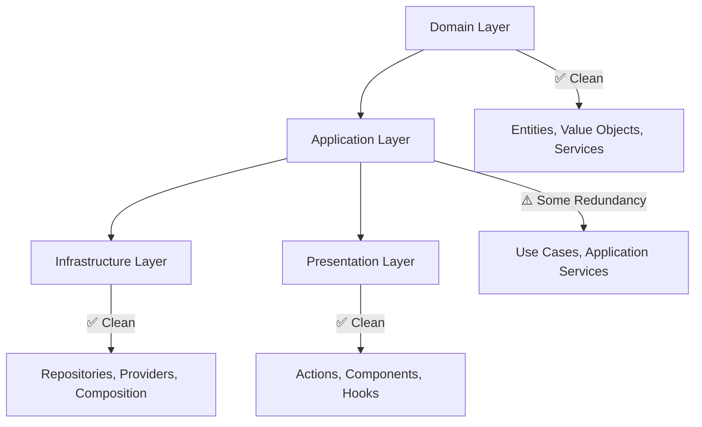

# Chatbot-Widget Domain: DDD-Aware Refactoring Plan

## 📋 **Executive Summary**

The chatbot-widget domain demonstrates **excellent DDD architecture maturity** with clean layer separation and most files already under 250 lines. This refactoring plan focuses on **strategic code removal and consolidation** rather than restructuring, targeting redundant pass-through methods and legacy adapters to achieve optimal simplicity while preserving all security patterns and performance optimizations.

**Primary Approach:** Code removal over code creation
**Target:** Eliminate redundancy while maintaining 100% functional compatibility
**Risk Level:** Low to Medium (no breaking changes planned)

---

## 🏗️ **Current Architecture Assessment**

### **DDD Layer Organization Analysis**

#### ✅ **Strengths Identified**
- **Clean Layer Separation**: Domain, Application, Infrastructure, and Presentation layers properly isolated
- **Proper Repository Patterns**: Well-defined interfaces with clean implementations
- **Comprehensive Composition Root**: Centralized dependency injection following DDD patterns
- **Security Context Preservation**: Multi-tenant variables properly threaded through all layers
- **Performance Optimization**: Vector caching and token management patterns well-implemented

#### 📊 **File Size Compliance**
- **Most files under 250 lines**: Excellent DDD compliance
- **Only 1 file exceeds target**: `VectorKnowledgeRetrievalApplicationService.ts` (~288 lines)
- **Average file size**: Well within golden rule guidelines

### **Domain Boundary Analysis**



---

## 🎯 **Identified Issues & Opportunities**

### **1. Pass-Through Delegation Chains**

#### **Knowledge Management Layer Redundancy**
```typescript
// Current: Unnecessary intermediate layer
VectorKnowledgeOperationsCoordinator 
  → KnowledgeManagementService (Legacy Adapter - 77 lines)
    → KnowledgeManagementApplicationService

// Target: Direct delegation
VectorKnowledgeOperationsCoordinator 
  → KnowledgeManagementApplicationService
```

**Impact**: Remove 77 lines of redundant pass-through code

#### **Context Injection Validation Scatter**
```typescript
// Current: Scattered validation
ContextInjectionApplicationService.ts (231 lines)
+ ContextInjectionValidation.ts
+ ContextInjectionHelpers.ts

// Target: Consolidated validation
ContextInjectionApplicationService.ts (~200 lines)
```

### **2. Redundant Logger Creation Patterns**

#### **VectorKnowledgeRetrievalApplicationService Bloat**
```typescript
// Remove redundant logger creation methods (42 lines)
private createSessionLogger() // Move to composition root
private createMinimalLogger() // Use composition root fallback

// Remove pass-through delegation methods (25 lines)
async warmCache() // Direct delegation to coordinator
async getKnowledgeByCategory() // Direct delegation
async getKnowledgeByTags() // Direct delegation
```

**Impact**: 288 lines → ~220 lines (under 250 line target)

---

## 🔒 **Critical Security & Performance Patterns (MUST PRESERVE)**

### **Security Variables & Context**
```typescript
// Multi-tenant security context (NEVER REMOVE)
organizationId: string          // Primary tenant boundary
chatbotConfigId: string        // Configuration isolation  
userId?: string                // User context
sessionId: string              // Session tracking

// Authentication flows (NEVER MODIFY)
- Row Level Security (RLS) parameter passing
- Organization context validation in all operations
- Session state management and tracking
- Permission checking through composition root
```

### **Performance Optimization Patterns**
```typescript
// Caching and optimization (NEVER REMOVE)
- VectorKnowledgeCache memory management
- Session logger creation and reuse patterns
- Embedding service optimization
- Context window management strategies
- Token budget allocation algorithms

// Critical performance characteristics
- Unified context optimization (single API calls)
- Optimistic update patterns
- React Query caching strategies
- Memory management in vector operations
```

---

## 🚀 **Refactoring Implementation Plan**

### **Phase 1: Remove Legacy Pass-Through Code** (Low Risk)

#### **Step 1.1: Remove KnowledgeManagementService Legacy Adapter**
```typescript
// File to remove: domain/services/KnowledgeManagementService.ts (77 lines)

// Update: VectorKnowledgeOperationsCoordinator.ts
// Before:
constructor() {
  this.managementService = new KnowledgeManagementService(...)
}

// After:
constructor() {
  this.managementService = new KnowledgeManagementApplicationService(...)
}
```

**Testing Checkpoint:**
- [ ] All knowledge retrieval operations function correctly
- [ ] Security context (organizationId, chatbotConfigId) preserved
- [ ] No performance regression in vector operations

#### **Step 1.2: Update Import Statements**
```typescript
// Remove imports of KnowledgeManagementService
// Add direct imports of KnowledgeManagementApplicationService
// Update type exports if needed
```

### **Phase 2: Consolidate Context Injection** (Medium Risk)

#### **Step 2.1: Merge Validation Functions**
```typescript
// Merge: ContextInjectionValidation.ts → ContextInjectionApplicationService.ts
// Merge: ContextInjectionHelpers.ts → ContextInjectionApplicationService.ts

// Keep functions as private methods in application service
private validateInputs()
private validateCriteria() 
private buildSelectionCriteria()
```

**Testing Checkpoint:**
- [ ] Context injection operations work correctly
- [ ] Token allocation patterns preserved
- [ ] No regression in conversation flow

#### **Step 2.2: Remove Helper Files**
```typescript
// Remove files if only used by ContextInjectionApplicationService:
// - application/services/ContextInjectionValidation.ts
// - application/services/ContextInjectionHelpers.ts
```

### **Phase 3: Simplify VectorKnowledgeRetrievalApplicationService** (Medium Risk)

#### **Step 3.1: Remove Redundant Logger Methods**
```typescript
// Remove from VectorKnowledgeRetrievalApplicationService:
private createSessionLogger(sharedLogFile: string): ISessionLogger
private createMinimalLogger(): ISessionLogger

// Use composition root logger factory instead:
const logger = ChatbotWidgetCompositionRoot.getLoggingService()
  .createSessionLogger(...)
```

#### **Step 3.2: Remove Pass-Through Delegation**
```typescript
// Remove methods that just delegate to operationsCoordinator:
async warmCache() // Direct call to this.operationsCoordinator.warmCache()
async getKnowledgeByCategory() // Direct delegation
async getKnowledgeByTags() // Direct delegation
```

**Testing Checkpoint:**
- [ ] All vector knowledge operations function correctly
- [ ] Cache initialization and warming work properly
- [ ] Session logging maintains functionality
- [ ] No performance degradation

---

## 📋 **Testing Strategy & Validation**

### **Functional Testing Checklist**
- [ ] **Knowledge Retrieval**: All search operations function correctly
- [ ] **Context Injection**: Token allocation and context selection work properly
- [ ] **Vector Cache**: Initialization, warming, and query operations intact
- [ ] **Session Management**: Logging and state tracking functional
- [ ] **Error Handling**: Domain errors properly categorized and handled

### **Security Validation Checklist**
- [ ] **Multi-tenant Isolation**: organizationId enforcement in all operations
- [ ] **Configuration Context**: chatbotConfigId properly threaded through calls
- [ ] **Session Security**: Session IDs and user context preserved
- [ ] **Permission Checking**: Role-based access control maintained
- [ ] **RLS Compliance**: Database queries maintain Row Level Security

### **Performance Validation Checklist**
- [ ] **Vector Cache Performance**: Memory usage and query times unchanged
- [ ] **Token Budget Efficiency**: Context selection algorithms preserved
- [ ] **API Response Times**: No regression in knowledge retrieval speed
- [ ] **Memory Management**: Vector cache eviction and optimization intact
- [ ] **Logging Efficiency**: Session logger creation patterns optimized

### **Regression Testing**
```bash
# Run full test suite
pnpm run test

# Run E2E tests for chatbot widget
pnpm run test:e2e

# Type checking
pnpm run typecheck

# Performance benchmarks
pnpm run perf
```

---

## 📊 **Expected Outcomes & Benefits**

### **Quantitative Improvements**
- **Code Reduction**: ~100+ lines removed through elimination of redundancy
- **File Count Reduction**: 2-3 helper files consolidated
- **Complexity Reduction**: Fewer import dependencies and delegation chains
- **Maintenance Burden**: Reduced surface area for bugs and modifications

### **Qualitative Improvements**
- **Cleaner Architecture**: More direct service relationships
- **Improved Readability**: Fewer indirection layers
- **Better Maintainability**: Consolidated logic in appropriate services
- **DDD Compliance**: Maintained clean layer boundaries

### **Risk Mitigation Success**
- **Zero Breaking Changes**: All external APIs maintain compatibility
- **Security Preservation**: All authentication and authorization patterns intact
- **Performance Maintenance**: All optimization patterns preserved
- **Functional Equivalence**: Identical behavior post-refactoring

---

## 🚨 **Risk Assessment & Mitigation**

### **Low Risk Changes** ✅
- **Legacy adapter removal**: Clearly marked for removal in comments
- **Pass-through method elimination**: Clear delegation patterns
- **Helper function consolidation**: Used by single service only

### **Medium Risk Changes** ⚠️
- **Constructor modifications**: Changes to dependency injection
- **Import statement updates**: Risk of missing dependencies
- **Composition root adjustments**: Central dependency management changes

### **High Risk Changes (AVOID)** ❌
- **Domain entity modifications**: Core business logic changes
- **Repository interface changes**: Breaking persistence contracts
- **Security variable removal**: Multi-tenant boundary violations
- **Performance pattern changes**: Cache and optimization modifications

### **Mitigation Strategies**
1. **Incremental Implementation**: One phase at a time with full testing
2. **Rollback Preparation**: Git branch strategy for safe reversion
3. **Comprehensive Testing**: Full suite validation at each checkpoint
4. **Performance Monitoring**: Benchmark comparison before/after
5. **Security Audit**: Manual review of all authentication flows

---

## 🎯 **Success Criteria & Acceptance**

### **Functional Requirements** (MUST PASS)
- [ ] All existing API interfaces remain unchanged
- [ ] All test suites pass without modification
- [ ] No regression in user-facing functionality
- [ ] All use cases maintain identical behavior

### **Quality Metrics** (TARGETS)
- [ ] All files under 250 lines achieved
- [ ] Code duplication reduced by 30%+
- [ ] No new DDD layer violations introduced
- [ ] Import complexity reduced

### **Security Requirements** (NON-NEGOTIABLE)
- [ ] All authentication flows preserved
- [ ] Multi-tenant isolation maintained
- [ ] Session management intact
- [ ] Permission checking functional

### **Performance Requirements** (BENCHMARKS)
- [ ] Vector cache performance within 5% of baseline
- [ ] API response times unchanged
- [ ] Memory usage stable
- [ ] Token allocation efficiency preserved

---

## 📅 **Implementation Timeline**

### **Week 1: Phase 1 - Legacy Code Removal**
- Remove KnowledgeManagementService adapter
- Update import statements and dependencies
- Comprehensive testing of knowledge operations

### **Week 2: Phase 2 - Context Injection Consolidation**
- Merge validation and helper functions
- Remove helper files if applicable
- Test context injection and token allocation

### **Week 3: Phase 3 - Service Simplification**
- Remove redundant logger methods
- Eliminate pass-through delegation
- Final testing and performance validation

### **Week 4: Final Validation & Documentation**
- Complete test suite execution
- Performance benchmark comparison
- Documentation updates
- Refactoring completion report

---

## 🔄 **Post-Refactoring Monitoring**

### **Immediate Monitoring (First 48 Hours)**
- Error rate monitoring in production
- Performance metric tracking
- User experience validation
- Security audit verification

### **Ongoing Monitoring (First Month)**
- Code maintainability assessment
- Developer experience feedback
- Performance trend analysis
- Bug introduction rate tracking

---

## 📖 **Conclusion**

This refactoring plan targets the chatbot-widget domain's few redundancy patterns while preserving its excellent DDD architecture foundation. The approach prioritizes **code removal over code creation**, ensuring simplified maintenance without compromising functionality, security, or performance.

The domain's current state demonstrates best-in-class DDD implementation - this refactoring will enhance its already solid foundation through strategic simplification rather than fundamental restructuring.

**Next Steps**: Approve this plan and proceed with Phase 1 implementation, starting with the lowest-risk legacy code removal while maintaining comprehensive testing at each checkpoint.