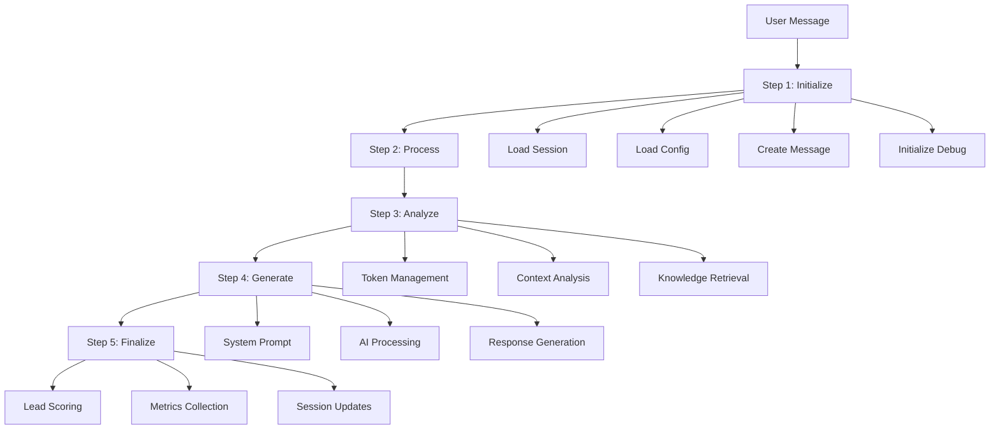
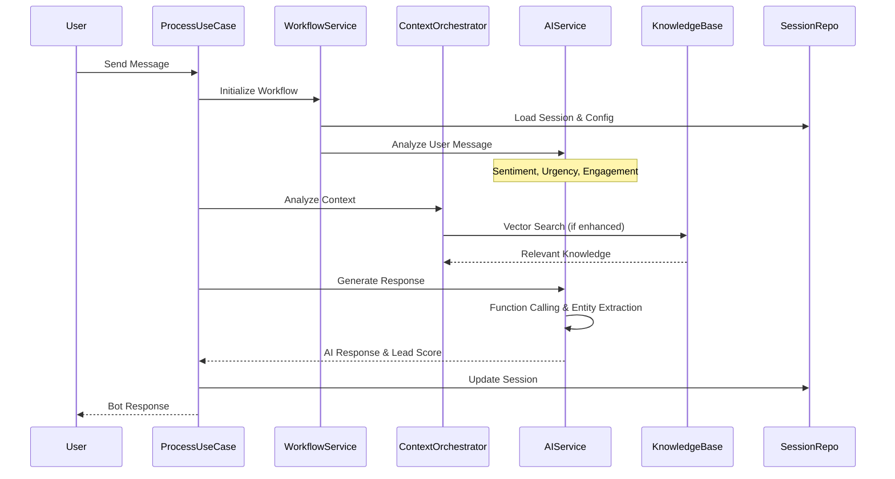
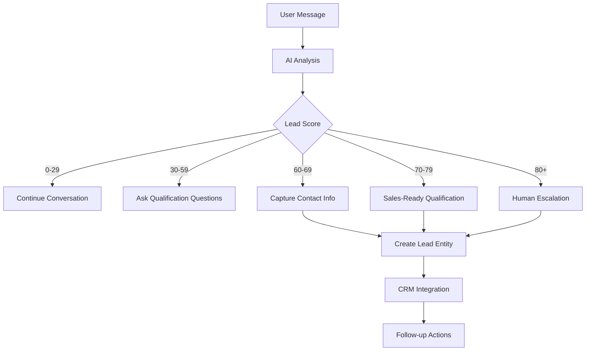
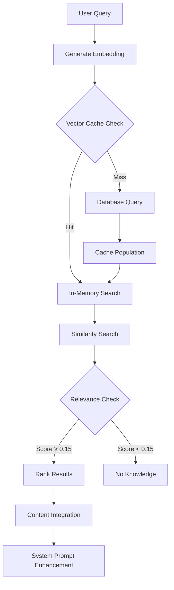
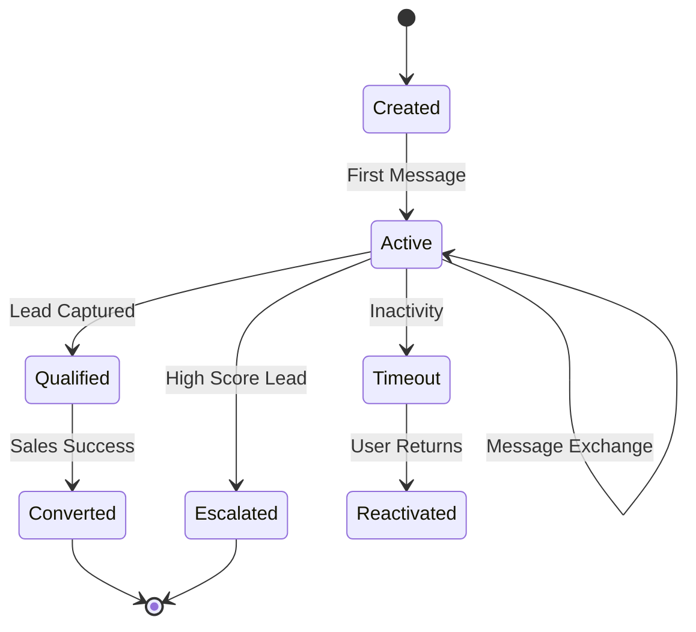
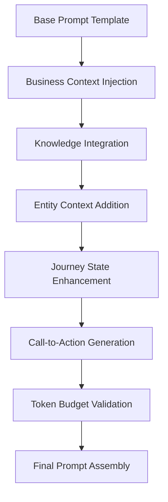
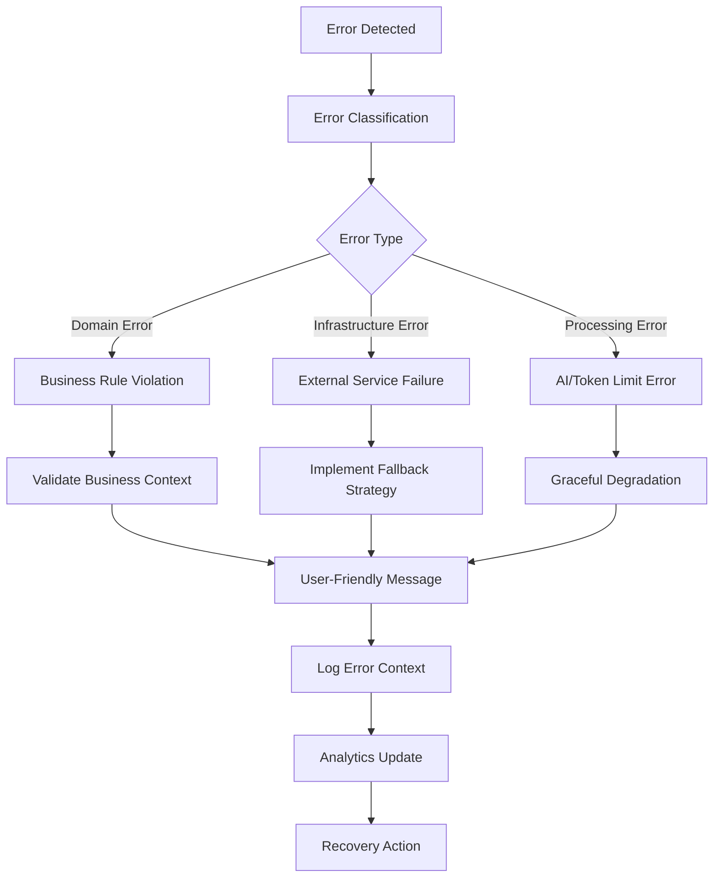
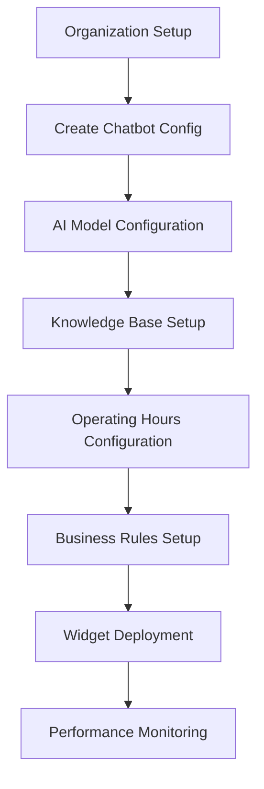

# Chatbot Widget - Business Logic Pipelines

## Overview

The chatbot-widget domain implements sophisticated AI-powered conversational workflows through a comprehensive 5-step processing pipeline. This document details the business logic flows, data transformations, and integration patterns that power the conversational AI system.

## Table of Contents

1. [Core Message Processing Pipeline](#core-message-processing-pipeline)
2. [Conversation Flow Architecture](#conversation-flow-architecture)
3. [Lead Capture and Qualification Workflows](#lead-capture-and-qualification-workflows)
4. [Knowledge Base Processing Pipeline](#knowledge-base-processing-pipeline)
5. [Session Management and Context Building](#session-management-and-context-building)
6. [AI Prompt Assembly and Coordination](#ai-prompt-assembly-and-coordination)
7. [Error Handling and Recovery Workflows](#error-handling-and-recovery-workflows)
8. [Configuration and Setup Pipelines](#configuration-and-setup-pipelines)

## Core Message Processing Pipeline

### ProcessChatMessageUseCase: 5-Step Workflow

The central orchestration service that handles all user messages through a sophisticated 5-step pipeline:



#### Step 1: Initialize Workflow and Validate Prerequisites

**Purpose**: Establish processing context and validate system state.

```typescript
// Workflow Initialization
const initializeWorkflow = async (command: SendMessageCommand) => {
  // 1. Load and validate chat session
  const session = await sessionRepository.findById(command.sessionId);
  if (!session || !session.isActive) {
    throw new SessionNotFoundError(command.sessionId);
  }
  
  // 2. Load chatbot configuration with operating hours validation
  const config = await configRepository.findById(session.chatbotConfigId);
  await operatingHoursService.validateCurrentTime(config.operatingHours);
  
  // 3. Create and save user message with AI analysis
  const userMessage = await this.createAnalyzedUserMessage(command, session);
  await messageRepository.save(userMessage);
  
  // 4. Initialize debug session for comprehensive tracking
  const debugSession = await debugService.initializeSession({
    sessionId: command.sessionId,
    messageId: userMessage.id,
    workflowType: 'ProcessChatMessage'
  });
  
  return { session, config, userMessage, debugSession };
};
```

**Key Operations**:
- Session validation and activity checks
- Configuration loading with business rules validation
- Message creation with AI-powered sentiment, urgency, and engagement analysis
- Debug session initialization for comprehensive tracking

**Data Flow**: `sessionId` → `ChatSession` + `ChatbotConfig` + analyzed `ChatMessage`

#### Step 2: Process User Message and Update Session

**Purpose**: Prepare message context and update session state.

```typescript
// Message Processing
const processUserMessage = async (initResult: InitializeResult) => {
  // 1. Simple context preparation and validation
  const messageContext = await contextService.prepareMessageContext({
    session: initResult.session,
    config: initResult.config,
    userMessage: initResult.userMessage
  });
  
  // 2. Session state updates
  const updatedSession = initResult.session
    .addMessage(initResult.userMessage)
    .updateLastActivity(new Date());
    
  await sessionRepository.save(updatedSession);
  
  return { messageContext, session: updatedSession };
};
```

**Key Operations**:
- Context preparation with session state
- Session updates with message history
- Activity timestamp management

**Data Flow**: `WorkflowContext` → `MessageProcessingContext`

#### Step 3: Analyze Conversation Context

**Purpose**: Perform deep context analysis with knowledge retrieval and token management.

```typescript
// Context Analysis with Knowledge Integration
const analyzeConversationContext = async (processResult: ProcessResult) => {
  // 1. Token-aware context window management (16K tokens max)
  const contextWindow = await tokenService.buildOptimalContextWindow({
    messages: processResult.session.messages,
    maxTokens: 16000,
    systemPromptReserved: 800,
    responseReserved: 3500
  });
  
  // 2. Message prioritization using relevance analysis
  const prioritizedMessages = await relevanceService.prioritizeMessages(
    contextWindow.messages,
    processResult.messageContext.userMessage
  );
  
  // 3. Enhanced context analysis with vector knowledge retrieval
  let enhancedContext = processResult.messageContext;
  
  if (await this.shouldTriggerEnhancedAnalysis(processResult.messageContext)) {
    enhancedContext = await enhancedAnalysisService.analyzeWithKnowledge({
      context: processResult.messageContext,
      prioritizedMessages,
      knowledgeRetrievalEnabled: true
    });
  }
  
  return { enhancedContext, tokenBudget: contextWindow.budget };
};
```

**Key Operations**:
- Token budget management with 16K context window
- Message prioritization based on relevance scoring
- Knowledge base vector search integration
- Enhanced context analysis triggering

**Data Flow**: `MessageContext` → `EnhancedContext` with vector knowledge

**Decision Points**:
- Enhanced analysis trigger: Based on message complexity and knowledge availability
- Token management: Intelligent compression when approaching limits
- Knowledge relevance: Semantic similarity threshold of 0.15

#### Step 4: Generate AI Response

**Purpose**: Orchestrate AI processing through unified response generation.

```typescript
// Unified AI Response Generation
const generateAIResponse = async (analysisResult: AnalysisResult) => {
  // 1. System prompt building with knowledge integration
  const systemPrompt = await systemPromptBuilder.buildPrompt({
    config: analysisResult.config,
    context: analysisResult.enhancedContext,
    knowledgeContent: analysisResult.enhancedContext.knowledgeContent,
    tokenBudget: analysisResult.tokenBudget
  });
  
  // 2. Unified AI processing through OpenAI function calling
  const aiResult = await unifiedResponseProcessor.processWithFunctionCalling({
    systemPrompt,
    messages: analysisResult.enhancedContext.conversationHistory,
    functionDefinitions: this.getActiveFunctionDefinitions(),
    model: analysisResult.config.aiConfiguration.model
  });
  
  // 3. Response message creation with comprehensive metadata
  const botMessage = ChatMessage.createBotMessage({
    sessionId: analysisResult.session.id,
    content: aiResult.response.content,
    aiMetadata: aiResult.metadata,
    processingMetrics: aiResult.metrics
  });
  
  await messageRepository.save(botMessage);
  
  return { botMessage, aiResult };
};
```

**Key Operations**:
- System prompt assembly with knowledge integration
- OpenAI function calling with structured responses
- Entity extraction and lead scoring through AI analysis
- Response message creation with metadata

**Data Flow**: `EnhancedContext` → `UnifiedAIResult` → `ChatMessage`

#### Step 5: Finalize Workflow and Calculate Metrics

**Purpose**: Complete workflow with lead decisions, metrics, and session updates.

```typescript
// Workflow Finalization
const finalizeProcessing = async (responseResult: ResponseResult) => {
  // 1. Lead capture decision logic based on AI scoring
  let leadCaptureResult = null;
  if (responseResult.aiResult.leadScore >= 60) {
    leadCaptureResult = await leadCaptureService.evaluateAndCapture({
      sessionId: responseResult.session.id,
      aiAnalysis: responseResult.aiResult,
      organizationId: responseResult.session.organizationId
    });
  }
  
  // 2. Conversation metrics calculation
  const metrics = await metricsService.calculateConversationMetrics({
    session: responseResult.session,
    userMessage: responseResult.userMessage,
    botMessage: responseResult.botMessage,
    processingDuration: Date.now() - responseResult.startTime
  });
  
  // 3. Final session state updates
  const finalSession = responseResult.session
    .addMessage(responseResult.botMessage)
    .updateMetrics(metrics);
    
  await sessionRepository.save(finalSession);
  
  return {
    response: responseResult.botMessage.content,
    leadCaptured: leadCaptureResult?.captured || false,
    metrics,
    sessionId: responseResult.session.id
  };
};
```

**Key Operations**:
- Lead capture decision with 60+ score threshold
- Comprehensive metrics calculation
- Session state finalization and persistence

**Data Flow**: `ResponseResult` → `FinalResult` with metrics

## Conversation Flow Architecture

### Message Processing Flow



### Context Management Strategy

**Token Budget Allocation**:
- System Prompt: 800 tokens (base + knowledge)
- Response Generation: 3,500 tokens
- Summary Buffer: 300 tokens
- Context Window: 16,000 tokens total

**Message Prioritization Algorithm**:
```typescript
// Relevance-based message retention
const prioritizeMessages = (messages: ChatMessage[], currentMessage: ChatMessage) => {
  return messages
    .map(msg => ({
      message: msg,
      relevanceScore: calculateRelevanceScore(msg, currentMessage),
      tokenCount: msg.getTokenCount()
    }))
    .sort((a, b) => b.relevanceScore - a.relevanceScore)
    .filter(item => item.relevanceScore > 0.3); // Relevance threshold
};
```

## Lead Capture and Qualification Workflows

### Lead Scoring Pipeline



### Lead Capture Decision Logic

```typescript
// Lead Capture Service Implementation
export class LeadCaptureDecisionService {
  async evaluateAndCapture(params: LeadEvaluationParams): Promise<LeadCaptureResult> {
    const { sessionId, aiAnalysis, organizationId } = params;
    
    // Score-based decision making
    if (aiAnalysis.leadScore >= 60) {
      const lead = await this.createLead({
        sessionId,
        organizationId,
        contactInfo: aiAnalysis.extractedEntities.contactInfo,
        qualificationData: aiAnalysis.extractedEntities.qualificationData,
        leadScore: aiAnalysis.leadScore,
        source: LeadSource.CHATBOT_CONVERSATION
      });
      
      // Trigger follow-up workflows based on score
      if (aiAnalysis.leadScore >= 80) {
        await this.triggerHumanEscalation(lead);
      } else if (aiAnalysis.leadScore >= 70) {
        await this.markAsSalesReady(lead);
      }
      
      return { captured: true, lead, score: aiAnalysis.leadScore };
    }
    
    return { captured: false, score: aiAnalysis.leadScore };
  }
}
```

### Entity Extraction Workflow

**AI-Driven Entity Accumulation**:
```typescript
// Progressive entity building across conversation
interface AccumulatedEntities {
  // Individual entities with confidence tracking
  visitorName?: {
    value: string;
    confidence: number;
    lastUpdated: string;
    sourceMessageId: string;
  };
  
  // Array entities (accumulative across messages)
  decisionMakers: string[];
  painPoints: string[];
  integrationNeeds: string[];
  budget: string[];
  timeline: string[];
}
```

## Knowledge Base Processing Pipeline

### Vector Embeddings and Search Flow



### Knowledge Retrieval Implementation

```typescript
// Vector Knowledge Retrieval Service
export class VectorKnowledgeRetrievalService {
  async retrieveRelevantKnowledge(
    query: string,
    options: RetrievalOptions = {}
  ): Promise<KnowledgeRetrievalResult> {
    
    // 1. Generate query embedding
    const embedding = await this.embeddingService.generateEmbedding(query);
    
    // 2. Check vector cache (50MB limit, 10K vectors max)
    let searchResults = await this.vectorCache.search(embedding, {
      threshold: options.relevanceThreshold || 0.15,
      limit: options.maxResults || 5
    });
    
    // 3. Fallback to database if cache miss
    if (searchResults.length === 0 && !this.vectorCache.hasEmbedding(embedding)) {
      searchResults = await this.supabaseVectorRepo.similaritySearch(embedding, {
        threshold: 0.15,
        limit: 5,
        organizationId: options.organizationId
      });
      
      // 4. Populate cache for future queries
      await this.vectorCache.store(embedding, searchResults);
    }
    
    // 5. Rank and format results
    const rankedResults = this.rankByRelevance(searchResults, query);
    
    return {
      query,
      results: rankedResults,
      processingTime: Date.now() - startTime,
      cacheHit: searchResults.length > 0
    };
  }
}
```

### Cache Management Strategy

**Vector Cache Architecture**:
- **In-Memory Storage**: 50MB limit with LRU eviction
- **Performance Target**: <50ms for cached searches
- **Cache Population**: Lazy loading with background warming
- **Expiration**: 24-hour TTL with usage-based extension

## Session Management and Context Building

### Session Lifecycle Management



### Context Building Strategy

```typescript
// Session Context Service Implementation
export class SessionContextService {
  async accumulateContext(
    session: ChatSession,
    newMessage: ChatMessage,
    aiAnalysis: AIAnalysisResult
  ): Promise<SessionContext> {
    
    // 1. Update conversation summary with progressive summarization
    const updatedSummary = await this.conversationSummarizer.updateSummary({
      currentSummary: session.sessionContext.conversationSummary,
      newMessage,
      aiAnalysis,
      maxSummaryLength: 500
    });
    
    // 2. Accumulate extracted entities with confidence tracking
    const updatedEntities = this.mergeExtractedEntities(
      session.sessionContext.accumulatedEntities,
      aiAnalysis.extractedEntities
    );
    
    // 3. Update conversation phase based on AI analysis
    const conversationPhase = this.determineConversationPhase(
      aiAnalysis.intentClassification,
      updatedEntities,
      session.messages.length
    );
    
    // 4. Calculate response quality metrics
    const responseQuality = await this.assessResponseQuality({
      userMessage: newMessage,
      sessionHistory: session.messages,
      userEngagement: aiAnalysis.engagementMetrics
    });
    
    return SessionContext.create({
      conversationSummary: updatedSummary,
      currentPhase: conversationPhase,
      accumulatedEntities: updatedEntities,
      responseQuality,
      lastUpdated: new Date()
    });
  }
}
```

## AI Prompt Assembly and Coordination

### System Prompt Building Pipeline



### Dynamic Prompt Service Implementation

```typescript
// Dynamic Prompt Service with Coordination
export class DynamicPromptService {
  async generateSystemPrompt(
    config: ChatbotConfig,
    context: ConversationContext,
    knowledgeContent: KnowledgeContent[]
  ): Promise<PromptGenerationResult> {
    
    // 1. Base prompt generation with business context
    const basePrompt = await this.templateEngine.render('system-prompt', {
      businessContext: config.businessContext,
      personalitySettings: config.personalitySettings,
      currentDate: new Date().toISOString(),
      operatingHours: config.operatingHours
    });
    
    // 2. Knowledge content integration with deduplication
    const knowledgePrompt = await this.coordinateKnowledgeContent(
      knowledgeContent,
      context.tokenBudget.knowledgeAllocation
    );
    
    // 3. Entity context injection
    const entityContext = this.buildEntityContext(
      context.sessionContext.accumulatedEntities
    );
    
    // 4. Journey state and call-to-action generation
    const journeyPrompt = await this.generateJourneyContext(
      context.sessionContext.currentPhase,
      context.conversationObjectives
    );
    
    // 5. Final coordination and token validation
    const coordinatedPrompt = await this.promptCoordinator.coordinatePromptSections(
      new Map([
        ['base', [{ content: basePrompt, priority: PromptPriority.HIGH }]],
        ['knowledge', knowledgePrompt.sections],
        ['entity', [{ content: entityContext, priority: PromptPriority.MEDIUM }]],
        ['journey', [{ content: journeyPrompt, priority: PromptPriority.MEDIUM }]]
      ]),
      { enableDeduplication: true, maxTokens: context.tokenBudget.systemPrompt }
    );
    
    return {
      systemPrompt: coordinatedPrompt.finalPrompt,
      tokenCount: coordinatedPrompt.tokenCount,
      sectionsIncluded: coordinatedPrompt.sectionsIncluded,
      duplicatesRemoved: coordinatedPrompt.duplicatesRemoved
    };
  }
}
```

### Prompt Coordination and Deduplication

**Content Deduplication Strategy**:
```typescript
// Prompt Coordination Service Implementation
export class PromptCoordinationService {
  coordinatePromptSections(
    sectionsByService: Map<ServiceIdentifier, PromptSection[]>,
    options: PromptCoordinationOptions
  ): CoordinatedPromptResult {
    
    // 1. Apply service-specific section limits
    const limitedSections = this.applyServiceLimits(sectionsByService, options);
    
    // 2. Remove duplicate content based on content similarity
    const deduplicatedSections = this.deduplicateSections(
      this.flattenSections(limitedSections)
    );
    
    // 3. Resolve conflicts using priority-based strategy
    const conflictResolvedSections = this.resolveConflicts(
      deduplicatedSections.sections,
      options
    );
    
    // 4. Apply final ordering (priority-based, then type-based)
    const finalSections = this.applyOrdering(
      conflictResolvedSections.sections,
      options
    );
    
    return {
      sections: Object.freeze(finalSections),
      duplicatesRemoved: deduplicatedSections.duplicatesRemoved,
      conflictsResolved: conflictResolvedSections.conflictsResolved,
      servicePriorities: this.buildServicePriorityMappings(limitedSections)
    };
  }
}
```

## Error Handling and Recovery Workflows

### Error Classification and Recovery



### Error Tracking Implementation

```typescript
// Error Tracking Facade with Domain Context
export class ErrorTrackingFacade {
  async trackError(
    error: Error,
    context: ErrorContext,
    options: ErrorTrackingOptions = {}
  ): Promise<void> {
    
    // 1. Classify error based on domain context
    const classification = this.classifyError(error, context);
    
    // 2. Sanitize context for persistence
    const sanitizedContext = await this.sanitizeErrorContext(context);
    
    // 3. Determine persistence strategy based on severity
    if (this.shouldPersistError(classification.severity)) {
      await this.persistError({
        error,
        classification,
        context: sanitizedContext,
        timestamp: new Date(),
        organizationId: context.organizationId
      });
    }
    
    // 4. Generate fallback response for user
    const fallbackResponse = await this.generateFallbackResponse(
      classification,
      context
    );
    
    // 5. Update error analytics and trends
    await this.updateErrorAnalytics(classification, context);
    
    return fallbackResponse;
  }
}
```

### Recovery Strategies

**Graceful Degradation Patterns**:
- **AI Service Failure**: Fallback to template-based responses
- **Knowledge Base Unavailable**: Use cached content or basic responses
- **Token Limit Exceeded**: Intelligent context compression
- **Database Connectivity**: Read-only mode with local caching

## Configuration and Setup Pipelines

### Multi-Tenant Configuration Flow



### Configuration Management Implementation

```typescript
// Configuration Management Service
export class ConfigureChatbotUseCase {
  async execute(command: CreateChatbotConfigCommand): Promise<ChatbotConfig> {
    
    // 1. Validate organization permissions and limits
    await this.validateOrganizationLimits(command.organizationId);
    
    // 2. Apply default configurations with business rules
    const defaultConfig = await this.configDefaultsService.generateDefaults({
      organizationId: command.organizationId,
      industryType: command.industryType,
      useCase: command.primaryUseCase
    });
    
    // 3. Merge user preferences with defaults
    const mergedConfig = this.mergeConfigurationSettings(
      defaultConfig,
      command.userPreferences
    );
    
    // 4. Validate business rules and constraints
    await this.validateBusinessRules(mergedConfig);
    
    // 5. Create and persist configuration
    const chatbotConfig = ChatbotConfig.create(mergedConfig);
    await this.configRepository.save(chatbotConfig);
    
    // 6. Initialize supporting services
    await this.initializeSupportingServices(chatbotConfig);
    
    return chatbotConfig;
  }
}
```

### Performance Monitoring Pipeline

**Real-time Metrics Collection**:
- Response time tracking across all processing steps
- Token usage monitoring with cost calculation
- Lead conversion rate analysis
- Error rate and classification trending
- Cache hit rates and performance optimization

---

## Integration Points and Performance Optimization

### External Service Integration Patterns

**OpenAI Integration**:
- GPT-4 for conversation generation and analysis
- Function calling for structured data extraction
- Embedding generation for semantic search
- Token counting and cost optimization

**Supabase Integration**:
- Row Level Security for multi-tenant isolation
- Vector storage and similarity search
- Real-time subscriptions for live updates
- Batch operations for performance optimization

### Performance Optimization Strategies

**Caching Layers**:
1. **Vector Cache**: 50MB in-memory embeddings cache
2. **Session Cache**: Active session context optimization
3. **Configuration Cache**: Reduced database query overhead
4. **Template Cache**: Compiled prompt template storage

**Token Management**:
- Intelligent context window management (16K tokens)
- Message prioritization based on relevance
- Progressive summarization for long conversations
- Reserved token budgets for different processing stages

**Database Optimization**:
- Efficient query patterns with proper indexing
- Connection pooling for concurrent access
- Batch operations for bulk data processing
- Read replicas for analytics and reporting

---

This comprehensive pipeline documentation demonstrates how the chatbot-widget domain orchestrates complex AI-powered conversations through sophisticated business logic flows, intelligent decision-making, and robust error handling while maintaining enterprise-grade performance and scalability.