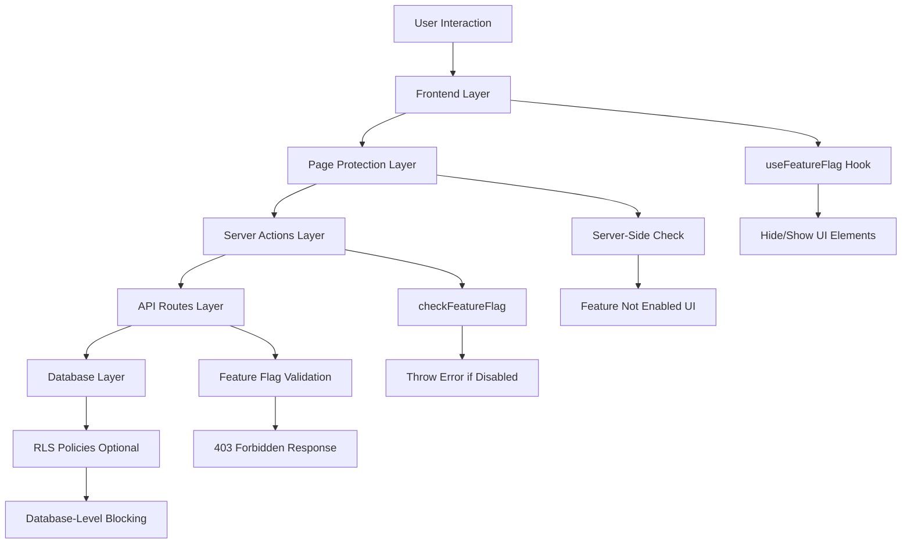

# Feature Flag System

**A comprehensive, organization-based feature entitlement system with defense-in-depth security.**

---

## 🎯 **Overview**

Our Feature Flag system enables **organization-level feature control** with granular access management. Features can be enabled or disabled on a per-organization basis, creating distinct product tiers and enabling controlled feature rollouts.

### **Key Benefits**
- ✅ **Product Tiers**: Create different feature sets for different organizations
- ✅ **Safe Rollouts**: Test features with specific organizations before global release
- ✅ **Revenue Control**: Gate premium features behind subscription tiers
- ✅ **Security First**: 4-layer defense prevents unauthorized access
- ✅ **DDD Compliant**: Maintains clean architecture boundaries

---

## 🏗️ **Architecture Overview**

### **4-Layer Defense-in-Depth Security**



### **Core Components**

#### **Database Schema**
```sql
-- Organization-level feature flags
organizations.feature_flags JSONB DEFAULT '{}'

-- Example values:
-- Acme Corp: {"dam": true, "tts": false}
-- TechStart: {"dam": true, "tts": true} 
-- BasicOrg: {} -- All features disabled
```

#### **Service Architecture**
```typescript
// Shared Core Service
lib/organization/application/services/FeatureFlagService.ts
├── checkFeatureFlag(flagName, featureName)
├── isFeatureEnabled(flagName)
└── getEnabledFeatures()

// Feature-Specific Services (DDD Boundaries)
lib/dam/application/services/DamFeatureFlagService.ts
lib/actions/services/TtsFeatureFlagService.ts
```

---

## 🚀 **Quick Start Guide**

### **For Frontend Developers**

#### **1. Check Feature Flags in Components**
```tsx
import { useFeatureFlag } from '@/lib/organization/presentation/hooks/useFeatureFlag';

export function MyComponent() {
  const isDamEnabled = useFeatureFlag('dam');
  const isTtsEnabled = useFeatureFlag('tts');
  
  return (
    <div>
      {isDamEnabled && (
        <Button>Access Digital Assets</Button>
      )}
      
      {isTtsEnabled && (
        <Button>Text-to-Speech</Button>
      )}
    </div>
  );
}
```

#### **2. Navigation Integration**
```typescript
// lib/config/navigation.ts
export const navigationItems = [
  {
    title: "Digital Assets",
    href: "/dam",
    featureFlag: "dam"  // Add this property
  },
  {
    title: "Text-to-Speech", 
    href: "/ai-playground/text-to-speech",
    featureFlag: "tts"  // Add this property
  }
];
```

### **For Backend Developers**

#### **1. Protect Server Actions**
```typescript
// lib/dam/application/actions/asset.actions.ts
import { checkDamFeatureFlag } from '../services/DamFeatureFlagService';

export async function createAsset(formData: FormData) {
  // 🛡️ ALWAYS add this check first
  await checkDamFeatureFlag();
  
  // ... your existing logic
}
```

#### **2. Protect API Routes**
```typescript
// app/api/dam/route.ts
import { isDamFeatureEnabled } from '@/lib/dam/application/services/DamFeatureFlagService';

export async function GET() {
  if (!await isDamFeatureEnabled()) {
    return new Response('DAM feature not enabled', { status: 403 });
  }
  
  // ... your existing logic
}
```

### **For Full-Stack Features**

#### **1. Page Protection**
```tsx
// app/(protected)/my-feature/page.tsx
import { getActiveOrganizationWithFlags } from '@/lib/organization/application/services/getActiveOrganizationWithFlags';
import { Ban } from 'lucide-react';

export default async function MyFeaturePage() {
  const organization = await getActiveOrganizationWithFlags(supabase);
  const flags = organization?.feature_flags as Record<string, boolean> | undefined;
  const isEnabled = flags?.my_feature ?? false;

  if (!isEnabled) {
    return (
      <main className="flex-1 px-4 pt-2 pb-4 overflow-auto">
        <div className="flex flex-col items-center justify-center h-full min-h-[calc(100vh-200px)] text-center">
          <Ban className="w-16 h-16 text-red-500 mb-4" />
          <h1 className="text-2xl font-bold mb-2">Feature Not Enabled</h1>
          <p className="text-muted-foreground">
            The My Feature feature is not enabled for your organization.
          </p>
        </div>
      </main>
    );
  }

  return <MyFeatureContent />;
}
```

---

## 📋 **Protected Features**

### **✅ Currently Implemented**

| Feature | Flag Name | Protection Level | Status |
|---------|-----------|------------------|--------|
| **Digital Asset Management (DAM)** | `dam` | 4-Layer Defense | ✅ Complete |
| **Text-to-Speech (TTS)** | `tts` | 4-Layer Defense | ✅ Complete |

#### **DAM Protection Coverage**
- ✅ Navigation hiding
- ✅ Page access control  
- ✅ 5 server action files protected
- ✅ 1 API route protected
- ✅ Upload, folder management, asset operations

#### **TTS Protection Coverage**
- ✅ Navigation hiding
- ✅ Page access control
- ✅ 6 server actions protected
- ✅ Generation, history, DAM integration

### **🔄 Available for Protection**
- Image Generation
- Reporting & Analytics
- Campaign Management
- Marketing Automation
- Integrations
- Advanced Settings

---

## 🛡️ **Security Model**

### **Default Off Security**
- All features are **disabled by default**
- Features must be **explicitly enabled** in organization settings
- Missing or `false` flag values deny access

### **Layer-by-Layer Protection**

#### **Layer 1: Frontend (UX)**
```typescript
// Hides UI elements when feature disabled
const isEnabled = useFeatureFlag('feature_name');
{isEnabled && <FeatureComponent />}
```

#### **Layer 2: Page Protection (Navigation)**
```typescript
// Shows "Feature Not Enabled" page
if (!flags?.feature_name) {
  return <FeatureNotEnabledUI />;
}
```

#### **Layer 3: Server Actions (Critical)**
```typescript
// Throws error before any business logic
await checkFeatureFlag('feature_name', 'Feature Name');
```

#### **Layer 4: API Routes (Defense)**
```typescript
// Returns 403 Forbidden
if (!await isFeatureEnabled('feature_name')) {
  return new Response('Feature not enabled', { status: 403 });
}
```

#### **Optional Layer 5: Database RLS**
```sql
-- Ultimate database-level protection
CREATE POLICY "feature_required" ON table_name
FOR ALL TO authenticated
USING (user_has_feature('feature_name'));
```

---

## 📊 **Configuration Examples**

### **Organization Feature Flag Examples**

```json
// Premium Enterprise Org
{
  "dam": true,
  "tts": true,
  "advanced_analytics": true,
  "api_access": true
}

// Standard Business Org  
{
  "dam": true,
  "tts": false,
  "advanced_analytics": false,
  "api_access": false
}

// Trial/Free Org
{
  "dam": false,
  "tts": false
}

// Default (All Disabled)
{}
```

### **Feature Rollout Scenarios**

#### **Beta Testing**
```json
// Enable for select beta organizations
"beta_org_1": {"new_feature": true}
"beta_org_2": {"new_feature": true}
"all_others": {"new_feature": false}
```

#### **Gradual Rollout**
```json
// Week 1: Premium customers only
"premium_orgs": {"new_feature": true}

// Week 2: All paid customers  
"paid_orgs": {"new_feature": true}

// Week 3: Everyone
"all_orgs": {"new_feature": true}
```

---

## 🔧 **Development Workflow**

### **Adding a New Feature Flag**

#### **1. Choose Flag Name**
- Use lowercase, underscore-separated format
- Be descriptive: `advanced_reporting`, `api_access`, `bulk_operations`

#### **2. Frontend Protection**
```typescript
// Add to navigation config
{
  title: "My Feature",
  href: "/my-feature", 
  featureFlag: "my_feature"  // Add this
}

// Use in components
const isEnabled = useFeatureFlag('my_feature');
```

#### **3. Page Protection**
```tsx
// Add server-side check to page.tsx
const flags = organization?.feature_flags as Record<string, boolean> | undefined;
const isEnabled = flags?.my_feature ?? false;

if (!isEnabled) {
  return <FeatureNotEnabledUI featureName="My Feature" />;
}
```

#### **4. Backend Protection**
```typescript
// Create feature service (recommended)
// lib/my-feature/application/services/MyFeatureService.ts
import { checkFeatureFlag } from '@/lib/organization/application/services/FeatureFlagService';

export async function checkMyFeatureFlag(): Promise<void> {
  await checkFeatureFlag('my_feature', 'My Feature');
}

// Add to all server actions
export async function myFeatureAction() {
  await checkMyFeatureFlag(); // Always first line
  // ... rest of logic
}
```

#### **5. Testing Checklist**
- [ ] UI elements hidden when flag disabled
- [ ] Page shows "Feature Not Enabled" when disabled  
- [ ] Server actions throw errors when disabled
- [ ] API routes return 403 when disabled
- [ ] Feature works normally when enabled

---

## 🎛️ **Management & Administration**

### **Current: Manual Database Management**
```sql
-- Enable feature for organization
UPDATE organizations 
SET feature_flags = feature_flags || '{"new_feature": true}'
WHERE id = 'org-uuid';

-- Disable feature for organization
UPDATE organizations 
SET feature_flags = feature_flags - 'new_feature'
WHERE id = 'org-uuid';
```

### **Coming Soon: Admin UI**
- 🔄 Super Admin dashboard for feature flag management
- 🔄 Organization-level feature request workflows
- 🔄 Bulk operations and rollout controls
- 🔄 Analytics and usage monitoring

See: [Post-MVP Improvement Roadmap](./post-mvp-improvement-roadmap.md)

---

## 🧪 **Testing & Validation**

### **Manual Testing Process**

#### **Feature Enabled Test**
1. Set organization flags: `{"feature_name": true}`
2. ✅ Verify navigation link appears
3. ✅ Verify page loads normally
4. ✅ Verify all functionality works
5. ✅ Verify server actions execute successfully

#### **Feature Disabled Test**  
1. Set organization flags: `{}` or `{"feature_name": false}`
2. ✅ Verify navigation link hidden
3. ✅ Verify direct URL shows "Feature Not Enabled"
4. ✅ Verify server actions throw errors
5. ✅ Verify API calls return 403

### **Automated Testing**
```typescript
// Example test structure
describe('Feature Flag Protection', () => {
  it('shows feature when enabled', async () => {
    mockFeatureFlag('my_feature', true);
    // Test feature availability
  });
  
  it('hides feature when disabled', async () => {
    mockFeatureFlag('my_feature', false);
    // Test feature blocking
  });
});
```

---

## 🔍 **Troubleshooting**

### **Common Issues**

#### **Feature Not Working Despite Flag Enabled**
1. Check organization context is loading correctly
2. Verify flag name spelling in all locations
3. Ensure server action protection is using correct flag name
4. Clear browser cache and test again

#### **UI Still Shows When Feature Disabled**
1. Verify `useFeatureFlag()` hook is being used
2. Check navigation configuration has correct `featureFlag` property
3. Ensure component conditional rendering is implemented
4. Test with organization that definitely has flag disabled

#### **Server Actions Not Protected**
1. Verify `checkFeatureFlag()` is first line in action
2. Ensure correct feature flag service is imported
3. Check that service is using correct flag name
4. Test with disabled organization to confirm error throwing

### **Debug Commands**
```typescript
// Check current organization flags
const { currentContext } = useOrganization();
console.log('Feature Flags:', currentContext?.feature_flags);

// Check specific flag
const isEnabled = useFeatureFlag('feature_name');
console.log('Feature Enabled:', isEnabled);
```

---

## 📚 **Additional Resources**

- [Post-MVP Improvement Roadmap](./post-mvp-improvement-roadmap.md) - Future enhancements
- [Complete Feature Flag Checklist](./complete-feature-flag-checklist.md) - Implementation guide
- [DDD Architecture Guidelines](../general/) - Domain-driven design patterns

---

## 🤝 **Contributing**

When adding new features or modifying existing ones:

1. **Follow the 4-layer protection pattern**
2. **Maintain DDD boundaries** with feature-specific services
3. **Test thoroughly** with both enabled/disabled states
4. **Update documentation** when adding new flags
5. **Use descriptive flag names** following naming conventions

---

**Questions?** Reach out to the development team or create an issue for clarification. 