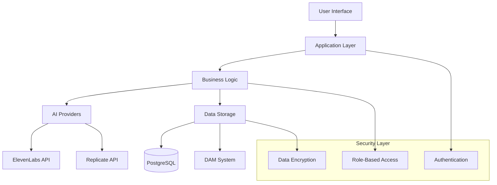
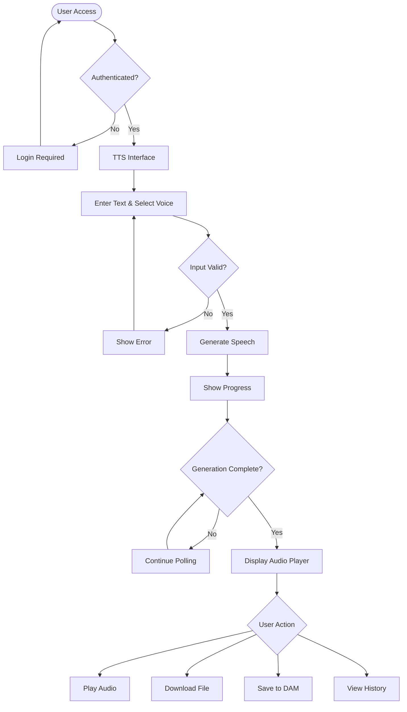
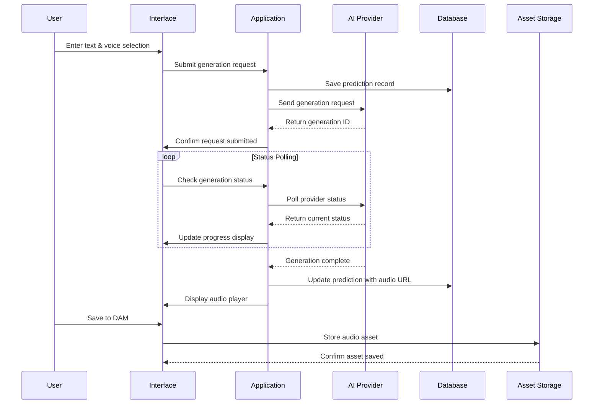
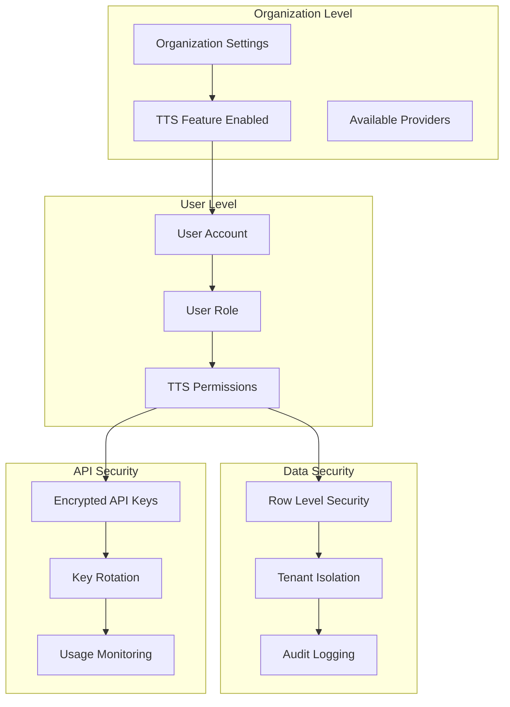

# Text-to-Speech (TTS) - Complete Feature Guide

## Executive Summary

The Text-to-Speech (TTS) feature is an enterprise-grade AI-powered solution that converts written text into natural-sounding speech using multiple premium AI providers. This capability transforms content creation workflows, enhances accessibility compliance, and enables rapid development of audio content across marketing, training, and documentation initiatives.

**Key Business Value:**
- **Cost Reduction**: Eliminates voice actor costs (typical savings: $500-2000 per project)
- **Speed to Market**: Instant audio generation vs. weeks of traditional production
- **Accessibility Compliance**: Automatic WCAG 2.1 AA compliance for digital content
- **Global Reach**: 40+ voice options supporting multiple languages and accents
- **Asset Management**: Integrated with Digital Asset Management system for organized content workflows

## Feature Overview

The TTS system provides a comprehensive platform for transforming text content into professional-quality audio assets. Built with enterprise security and multi-tenancy, it serves organizations from small teams to large enterprises requiring scalable content production capabilities.

**What It Does:**
- Converts text (up to 5,000 characters) into high-quality speech
- Supports multiple AI providers (ElevenLabs, Replicate) for voice variety
- Provides real-time generation status and progress tracking
- Automatically saves audio assets to the Digital Asset Management system
- Maintains comprehensive generation history with search capabilities
- Offers advanced audio controls with waveform visualization

**Why It Exists:**
- Accelerate content production timelines
- Reduce dependency on external voice talent
- Ensure consistent brand voice across all audio content
- Enable accessibility compliance for digital properties
- Provide scalable solution for high-volume content generation

## Core Capabilities

### 1. Multi-Provider AI Speech Generation
**ElevenLabs Integration**
- **Real-time Generation**: Instant audio output (typically 3-5 seconds)
- **Voice Quality**: Professional-grade voices with emotional nuance
- **Voice Options**: 25+ premium voices with distinct characteristics
- **Custom Voice Support**: Manual voice ID input for ElevenLabs subscribers

**Replicate Integration**  
- **Kokoro Model**: Advanced neural speech synthesis
- **Batch Processing**: Optimized for longer content generation
- **Cost Efficiency**: Lower per-character costs for high-volume usage
- **Voice Variety**: 15+ voices with different tones and styles

### 2. Advanced Text Management
**Text Input & Validation**
- Support for up to 5,000 characters per generation
- Real-time character and word counting
- Smart text formatting and validation
- Copy/paste optimization for various content sources

**Digital Asset Integration**
- Load existing text scripts from DAM library
- Edit loaded content with change tracking
- Save modified text back to original source
- Create new text assets from current input

### 3. Professional Audio Controls
**Audio Player Features**
- Waveform visualization for professional review
- Standard playback controls (play, pause, stop, seek)
- Volume control and playback speed adjustment
- Memory-efficient audio streaming

**Quality Assurance**
- Audio URL validation and error detection
- Automatic retry mechanisms for failed generations
- Quality indicators and metadata tracking
- Format optimization for web and download use

### 4. Comprehensive Asset Management
**DAM System Integration**
- One-click save to Digital Asset Management
- Custom asset naming with organizational standards
- Automatic metadata tagging (provider, voice, date)
- Linking between source text and generated audio

**Generation History**
- Complete audit trail of all generations
- Advanced search across text content and metadata
- Bulk operations for history management
- Replay functionality for iterative improvements

### 5. Enterprise Security & Permissions
**Multi-Tenant Architecture**
- Organization-level data isolation
- Role-based access control (planned)
- Feature flag controls for organizational requirements
- Comprehensive audit logging

**Data Protection**
- Row-level security for all user data
- Encrypted storage of sensitive information
- GDPR compliance for user data handling
- Secure API integration with external providers

## User Workflows

### Primary Workflow: Basic Speech Generation

**Step 1: Access TTS Interface**
1. Navigate to TTS feature from main application menu
2. System validates user permissions and organization access
3. Interface loads with current organizational settings

**Step 2: Configure Generation Parameters**
1. **Enter Text**: Type or paste content (up to 5,000 characters)
2. **Select Provider**: Choose between ElevenLabs or Replicate
3. **Choose Voice**: Browse voice catalog or enter custom voice ID
4. **Review Settings**: Confirm text length and provider selection

**Step 3: Generate Speech**
1. Click "Generate Speech" to start processing
2. System displays real-time progress indicators
3. Background polling tracks generation status
4. Audio player appears upon successful completion

**Step 4: Review & Manage Audio**
1. **Listen**: Use integrated audio player with waveform display
2. **Download**: Save audio file to local device
3. **Share**: Copy audio URL to clipboard for sharing
4. **Save to DAM**: Store in organizational asset library with custom naming

### Secondary Workflow: Content Creation Pipeline

**Step 1: Load Existing Content**
1. Access DAM integration panel within TTS interface
2. Browse organizational text assets
3. Select and load existing script or document
4. Text automatically populates in generation interface

**Step 2: Content Optimization**
1. Edit loaded text for TTS optimization
2. Review character count and formatting
3. Preview voice selection for content match
4. Save modifications back to source asset (optional)

**Step 3: Batch Processing**
1. Generate audio from optimized content
2. Save generated audio with descriptive naming
3. Link audio asset to source text in DAM
4. Add to project folders for organizational workflow

**Step 4: History Management**
1. Access comprehensive generation history
2. Search previous generations by content or metadata
3. Replay audio for quality comparison
4. Download or re-save assets as needed

### Power User Workflow: Advanced Asset Management

**Step 1: Project Setup**
1. Define voice consistency standards for project
2. Prepare text content in standardized format
3. Establish DAM folder structure for organized storage

**Step 2: Systematic Generation**
1. Process content in logical sequences
2. Maintain voice selection consistency
3. Use descriptive naming conventions
4. Leverage generation history for quality control

**Step 3: Quality Assurance**
1. Review all generated audio using history panel
2. Compare voice consistency across assets
3. Re-generate specific items if quality standards not met
4. Document final voice/provider combinations for future reference

## Example Use Cases

### Marketing & Communications
**Scenario**: Marketing team needs voiceovers for 15 product videos
- **Traditional Approach**: $1,500-3,000 + 2-3 weeks production time
- **TTS Solution**: $50-100 + 2-3 hours with consistent voice branding
- **Outcome**: 95% cost reduction, immediate turnaround, unlimited revisions

### Training & Education  
**Scenario**: L&D team creating accessibility-compliant training modules
- **Requirements**: WCAG 2.1 AA compliance for 50+ training documents
- **Implementation**: Batch process all training text through TTS system
- **Benefits**: Automatic compliance, consistent delivery, easy updates

### Documentation & Support
**Scenario**: Technical writing team adding audio to help documentation
- **Challenge**: Making complex technical content more accessible
- **Solution**: Convert technical guides to audio using professional voices
- **Result**: Improved user experience, reduced support ticket volume

### Podcast & Content Creation
**Scenario**: Content team launching internal podcast series
- **Approach**: Use TTS for intro/outro segments and episode narration
- **Advantages**: Consistent voice branding, rapid episode production, cost control
- **Metrics**: 70% faster production, professional quality output

### Prototype & Development
**Scenario**: Product team building voice-enabled application prototype
- **Need**: Realistic voice samples for user testing and demo purposes
- **Implementation**: Generate sample dialogues and interface responses
- **Value**: Rapid prototyping, stakeholder buy-in, user feedback collection

## Technical Architecture (Simplified)

### System Components
The TTS system follows a sophisticated architecture designed for enterprise reliability:

**Frontend Interface**
- React-based user interface with real-time status updates
- Advanced form management with validation and error handling
- Integrated audio player with professional visualization features
- Responsive design supporting desktop and mobile workflows

**Application Services**
- Centralized orchestration of business logic and workflows
- Multi-provider abstraction enabling seamless provider switching
- Comprehensive error handling with user-friendly feedback
- Optimized API calls with intelligent caching and deduplication

**AI Provider Integration**
- Native integration with ElevenLabs and Replicate APIs
- Provider-specific optimization for performance and cost
- Automatic failover and retry mechanisms
- Real-time status polling for asynchronous operations

**Data Management**
- PostgreSQL database with advanced security features
- Row-level security ensuring multi-tenant data isolation
- Comprehensive audit trails for compliance requirements
- Optimized queries supporting large-scale organizational usage

### Security & Compliance
**Enterprise Security Features**
- Multi-tenant architecture with organization-level isolation
- Role-based access control with granular permissions
- Encrypted data storage and transmission
- Comprehensive audit logging for compliance reporting

**Data Protection**
- GDPR compliance for user data handling
- Secure API key management for external providers
- Automatic data retention and cleanup policies
- Privacy-by-design architecture ensuring minimal data exposure

## Integration Points

### Digital Asset Management (DAM) System
**Seamless Asset Workflow**
- Load existing text content from DAM library
- Save generated audio directly to DAM with metadata
- Automatic linking between source text and generated audio
- Integration with organizational folder structures and permissions

**Asset Lifecycle Management**
- Version control for text content modifications
- Metadata tracking for audio generation parameters
- Search and discovery across text and audio assets
- Bulk operations for enterprise-scale content management

### Authentication & Organization Management
**User Context Integration**
- Single sign-on compatibility with organizational authentication
- Automatic organization context switching
- Permission inheritance from organizational role assignments
- Feature access control based on subscription and organization settings

### Feature Flag System
**Dynamic Feature Control**
- Organization-level TTS feature enabling/disabling
- Provider-specific access control (ElevenLabs vs. Replicate)
- Usage quota management and monitoring
- A/B testing capabilities for feature rollouts

### External Service Integration
**AI Provider Management**
- Secure API key storage and rotation
- Provider health monitoring and automatic failover
- Cost tracking and usage analytics
- Performance optimization based on provider capabilities

## Visual Documentation

### System Architecture Flow

### User Journey Flow

### Data Flow Architecture  

### Permission & Security Model

## Troubleshooting Guide

### Common Issues & Solutions

**Issue**: "Generation failed with provider error"
- **Cause**: Temporary AI provider service interruption
- **Solution**: Wait 30 seconds and retry generation
- **Prevention**: Use alternative provider if available

**Issue**: "Audio URL not accessible"  
- **Cause**: Generated audio URL has expired (common with Replicate)
- **Solution**: Click "Mark as Problematic" button, then regenerate
- **Prevention**: Save important audio to DAM immediately after generation

**Issue**: "Text exceeds character limit"
- **Cause**: Input text over 5,000 character limit
- **Solution**: Break content into smaller segments or edit to reduce length
- **Prevention**: Use character counter to monitor input length

**Issue**: "Voice not found for selected provider"
- **Cause**: Invalid voice ID or provider mismatch
- **Solution**: Select voice from dropdown or verify voice ID format
- **Prevention**: Use voice selector instead of manual ID entry

**Issue**: "Permission denied accessing TTS feature"
- **Cause**: Organization TTS feature disabled or user lacks permissions
- **Solution**: Contact administrator to enable TTS feature
- **Prevention**: Verify organizational feature flags before accessing

### Performance Optimization

**Slow Generation Times**
- Try alternative provider (ElevenLabs typically faster for short content)
- Break large text into smaller segments
- Avoid special characters that may require additional processing

**Audio Quality Issues**
- Experiment with different voices for your content type
- Check text formatting (remove extra spaces, special characters)
- Use ElevenLabs for higher quality output when budget allows

**Interface Responsiveness**
- Clear browser cache if interface becomes sluggish
- Disable browser extensions that may interfere with audio playback
- Use Chrome or Firefox for optimal compatibility

## Frequently Asked Questions

### General Usage

**Q: What types of content work best with TTS?**
A: Clear, well-formatted text without excessive special characters. Marketing copy, training materials, and documentation perform excellently. Avoid text with complex formatting or non-standard punctuation.

**Q: How long does generation typically take?**
A: ElevenLabs: 3-10 seconds for most content. Replicate: 30-120 seconds depending on text length and system load.

**Q: Can I use the same voice across multiple generations?**
A: Yes, voice selections are preserved in your session. For consistency across projects, document your preferred voice IDs.

**Q: Is there a cost per generation?**
A: Costs depend on your organization's AI provider subscriptions. Contact your administrator for usage guidelines and any applicable quotas.

### Technical Questions

**Q: What audio formats are supported?**
A: Generated audio is provided in web-optimized formats (typically MP3 or WAV) suitable for both streaming and download.

**Q: Can I integrate TTS audio into other applications?**
A: Yes, generated audio URLs can be embedded in other systems. Consider saving important audio to DAM for permanent accessibility.

**Q: How long are audio URLs valid?**
A: ElevenLabs URLs are permanent. Replicate URLs may expire after 24-48 hours. Save important audio to DAM for long-term storage.

**Q: Can I batch process multiple texts?**
A: Currently, each generation is processed individually. Use the history panel to manage multiple generations efficiently.

### Administrative Questions

**Q: How do I enable TTS for my organization?**
A: Organization administrators can enable TTS through the feature flags system. Contact your platform administrator for assistance.

**Q: Can I control which providers my team can access?**
A: Yes, provider access can be configured at the organization level through feature flag settings.

**Q: Is usage tracked and reported?**
A: Yes, comprehensive usage analytics are available through the administrative interface, including generation counts, provider usage, and cost tracking.

**Q: How is sensitive content protected?**
A: All content is encrypted in transit and at rest. Multi-tenant architecture ensures complete data isolation between organizations.

### Troubleshooting

**Q: What should I do if generation consistently fails?**
A: Check your internet connection, try alternative providers, and contact support if issues persist across multiple providers.

**Q: Can I recover lost audio if I forgot to save to DAM?**
A: Check the generation history panel - recent generations remain accessible. However, save important audio to DAM immediately for permanent storage.

**Q: Why can't I hear generated audio?**
A: Verify browser audio permissions, check volume settings, and ensure your browser supports the audio format. Try refreshing the page if issues persist.

**Q: How do I report audio quality issues?**
A: Use the feedback mechanism in the interface or contact your organization's platform administrator with specific examples of quality concerns.

---

*This documentation represents the complete TTS feature guide as of the current platform release. For the latest updates and feature additions, refer to the platform release notes and organizational administrator communications.*