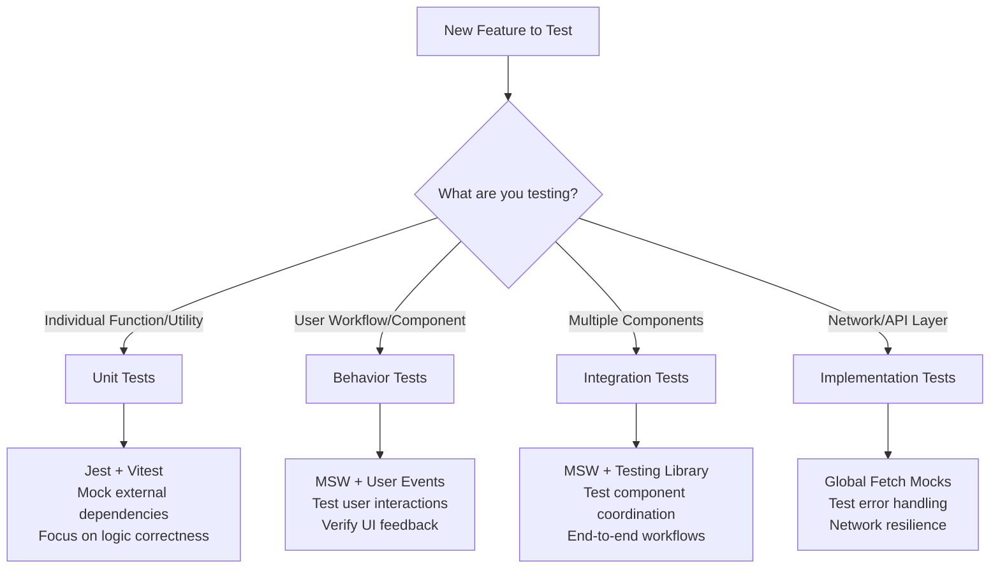

# Testing Best Practices Guide

## Overview

This guide provides decision-making frameworks for choosing the right testing approach for new features. Based on our experience achieving 100% test success with MSW, behavior testing, and comprehensive UI feedback testing.

## 🎯 Testing Philosophy

**Golden Rule:** Test behavior that users experience, not implementation details that developers write.

### Core Principles

1. **User-Centric**: Focus on what users see and experience
2. **Maintainable**: Tests should be resilient to implementation changes
3. **Realistic**: Use network-level mocking that mimics real API behavior
4. **Fast Feedback**: Catch UI feedback issues during development
5. **Documentation**: Tests serve as living documentation of expected behavior

---

## 📊 Testing Type Decision Tree

### 🔍 When to Use Each Testing Type



---

## 🛠️ Testing Approaches by Layer

### 1. **Utility/Service Layer** → Unit Tests
**When to use:** Pure functions, business logic, utilities

```typescript
// ✅ DO: Test pure business logic
describe('calculateFileSize', () => {
  it('should convert bytes to human readable format', () => {
    expect(calculateFileSize(1024)).toBe('1 KB');
    expect(calculateFileSize(1048576)).toBe('1 MB');
  });
});
```

**Tools:** Jest/Vitest with minimal mocking

---

### 2. **API/Network Layer** → Implementation Tests
**When to use:** Testing fetch wrappers, error handling, retry logic

```typescript
// ✅ DO: Test network implementation details
describe('ApiDeduplicationService', () => {
  beforeAll(() => server.close()); // Disable MSW
  
  it('should deduplicate identical requests', async () => {
    global.fetch = mockFetch;
    // Test the actual fetch implementation
    expect(mockFetch).toHaveBeenCalledTimes(1);
  });
});
```

**Tools:** Global fetch mocks, disable MSW

---

### 3. **React Hooks** → Behavior Tests
**When to use:** Testing data fetching, state management, user interactions

```typescript
// ✅ DO: Test hook behavior with MSW
describe('useAssetDelete', () => {
  it('should return success data when deletion succeeds', async () => {
    // MSW provides realistic API responses
    result.current.mutate('asset-123');
    
    await waitFor(() => {
      expect(result.current.isSuccess).toBe(true);
      expect(result.current.data).toEqual({
        success: true,
        message: 'Asset deleted successfully'
      });
    });
  });
});
```

**Tools:** MSW + React Query + Testing Library

---

### 4. **UI Components** → Behavior Tests
**When to use:** Testing user interactions, form submissions, UI feedback

```typescript
// ✅ DO: Test user behavior, not implementation
describe('AddTeamMemberForm', () => {
  it('successfully submits form and shows feedback to user', async () => {
    // Fill out form
    await user.type(nameInput, 'Test Name');
    await user.click(submitButton);

    // Test user-visible outcomes
    await waitFor(() => {
      expect(mockToast).toHaveBeenCalledWith({ title: 'Success' });
      expect(onSuccessMock).toHaveBeenCalled();
      expect(nameInput).toHaveValue(''); // Form reset
    });
  });
});
```

**Tools:** MSW + User Events + Testing Library

---

### 5. **Feature Workflows** → Integration Tests
**When to use:** Testing multiple components working together

```typescript
// ✅ DO: Test complete user workflows
describe('Asset Management Workflow', () => {
  it('should upload, display, and delete assets successfully', async () => {
    // Test complete user journey
    // Upload → Gallery → Delete → Confirmation
  });
});
```

**Tools:** MSW + User Events + Multiple Components

---

## 🚨 Anti-Patterns to Avoid

### ❌ Don't Test Implementation Details

```typescript
// ❌ DON'T: Test implementation
expect(mockFetch).toHaveBeenCalledWith('/api/endpoint');

// ✅ DO: Test behavior  
expect(screen.getByText('Success!')).toBeInTheDocument();
```

### ❌ Don't Mock What You Don't Own

```typescript
// ❌ DON'T: Mock React Query internals
vi.mock('@tanstack/react-query');

// ✅ DO: Use React Query test utils
const wrapper = createWrapper(); // Real React Query client
```

### ❌ Don't Mix Testing Approaches

```typescript
// ❌ DON'T: Mix MSW with fetch mocks in same test
server.use(handler);
global.fetch = mockFetch; // Conflicts!

// ✅ DO: Choose one approach per test suite
beforeAll(() => server.close()); // For implementation tests
// OR use MSW throughout for behavior tests
```

---

## 🎯 Feature Testing Decision Matrix

| Feature Type | Primary Testing Approach | Secondary | Tools |
|--------------|-------------------------|-----------|-------|
| **Data Fetching** | Behavior (MSW) | Unit (hooks) | MSW + React Query |
| **Form Handling** | Behavior (User Events) | Unit (validation) | User Events + MSW |
| **UI Components** | Behavior (Interactions) | Unit (rendering) | Testing Library + MSW |
| **Business Logic** | Unit (Pure functions) | Integration | Jest/Vitest |
| **API Routes** | Integration (End-to-end) | Unit (handlers) | MSW + Supertest |
| **Error Handling** | Implementation + Behavior | Unit | Global mocks + MSW |

---

## 📋 Test Planning Prompt Template

Use this prompt when asking for test plans for new features:

---

### **🧪 Test Plan Request Prompt**

```markdown
## Feature Test Plan Request

**Feature:** [Feature Name]

**User Story:** [User story or feature description]

**Components Involved:**
- [ ] React Components: [List components]
- [ ] Hooks: [List custom hooks]  
- [ ] API Endpoints: [List API routes]
- [ ] Services/Utilities: [List business logic]
- [ ] Database Operations: [List data operations]

**User Workflows:**
1. [Primary user workflow]
2. [Secondary workflows]
3. [Error scenarios]

**UI Feedback Required:**
- [ ] Success states (toasts, confirmations)
- [ ] Loading states (spinners, disabled buttons)
- [ ] Error states (error messages, validation)
- [ ] Form resets/updates

**Integration Points:**
- [ ] External APIs
- [ ] Database queries
- [ ] File uploads/downloads
- [ ] Real-time updates
- [ ] Authentication/permissions

**Performance Considerations:**
- [ ] Large data sets
- [ ] Network timeouts
- [ ] Debouncing/throttling
- [ ] Caching requirements

**Browser/Device Support:**
- [ ] Mobile responsiveness
- [ ] Accessibility requirements
- [ ] File type restrictions
- [ ] Browser compatibility

Please provide a comprehensive test plan including:
1. **Test pyramid breakdown** (unit/integration/behavior ratios)
2. **MSW handler requirements** for realistic API mocking
3. **User event test scenarios** for UI interactions
4. **Edge cases and error scenarios** to cover
5. **Performance test considerations**
6. **Accessibility testing requirements**

**Testing Tools to Consider:**
- MSW for API mocking
- User Events for interactions  
- React Query test utilities
- Jest/Vitest for utilities
- Testing Library for components
```

---

## 🔧 Quick Reference

### **MSW Setup Checklist**
- [ ] Add handlers in `lib/test/mocks/handlers.ts`
- [ ] Configure server in test setup
- [ ] Handle success/error scenarios
- [ ] Test network failures

### **Behavior Test Checklist** 
- [ ] Use realistic user interactions
- [ ] Test UI feedback (toasts, loading states)
- [ ] Verify form resets/updates
- [ ] Check accessibility attributes
- [ ] Test error message display

### **Implementation Test Checklist**
- [ ] Disable MSW (`server.close()`)
- [ ] Mock external dependencies only
- [ ] Test error handling logic
- [ ] Verify retry mechanisms

### **Integration Test Checklist**
- [ ] Test complete user workflows
- [ ] Use real component interactions
- [ ] Test cross-component communication
- [ ] Verify data flow

---

## 📚 Real Examples from Our Codebase

### **Success Story: Asset Deletion**
- **Problem:** UI showed errors instead of success messages
- **Solution:** Behavior tests with MSW caught the JSON parsing issue
- **Test Type:** Behavior testing with realistic API responses

### **Success Story: Team Member Forms**  
- **Problem:** Tests failed when MSW intercepted fetch calls
- **Solution:** Converted from implementation to behavior testing
- **Test Type:** User event testing with form interaction

### **Success Story: API Deduplication**
- **Problem:** Need to test fetch wrapper implementation
- **Solution:** Disabled MSW, used global fetch mocks
- **Test Type:** Implementation testing for service layer

---

## 🎯 Test Coverage Goals

- **70% Unit Tests:** Fast, focused, pure logic
- **20% Integration Tests:** Component coordination
- **10% E2E Tests:** Critical user journeys

**UI Feedback Coverage:**
- ✅ All success states tested
- ✅ All error states tested  
- ✅ All loading states tested
- ✅ All form validation tested

---

*This guide is living documentation. Update based on new patterns and discoveries.* 